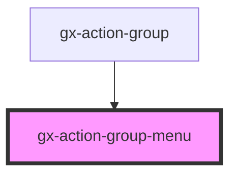

# gx-action-group-menu

It is in charge of grouping the actions items

<!-- Auto Generated Below -->

## Properties

| Property       | Attribute       | Description                                                                     | Type      | Default     |
| -------------- | --------------- | ------------------------------------------------------------------------------- | --------- | ----------- |
| `caption`      | `caption`       | The aria label for the accessibility of the component.                          | `""`      | `""`        |
| `closed`       | `closed`        | If the menu is opened or closed.                                                | `boolean` | `true`      |
| `cssClass`     | `css-class`     | A CSS class to set as the `gx-action-group-menu` element class.                 | `string`  | `undefined` |
| `disposedTop`  | `disposed-top`  | Visual disposition of the menu.                                                 | `boolean` | `false`     |
| `openIndex`    | `open-index`    | The index of item action that is targeted.                                      | `number`  | `null`      |
| `parentScroll` | `parent-scroll` | Used when the gx-action-group scroll changed, then update the position of menu. | `number`  | `0`         |
| `parentSize`   | `parent-size`   | Used when the gx-action-group scroll changed, then update the position of menu. | `number`  | `0`         |

## Slots

| Slot | Description                                   |
| ---- | --------------------------------------------- |
|      | The slot where you can put the actions items. |

## Dependencies

### Used by

- [gx-action-group](../action-group)

### Graph

---

_Built with [StencilJS](https://stenciljs.com/)_
