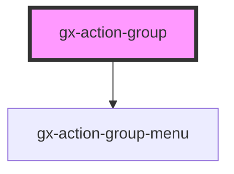

# GX Image Annotations

This component is used to group multiple actions items, where any action can have other actions items like its childrens and so on. It helps to easily create a toolbar.

<!-- Auto Generated Below -->

## Properties

| Property                    | Attribute                      | Description                                                                                                                                                                                                                                                                                                                                                                                                                                                                                                                                                                                                                                                                                                                                | Type                                                   | Default                 |
| --------------------------- | ------------------------------ | ------------------------------------------------------------------------------------------------------------------------------------------------------------------------------------------------------------------------------------------------------------------------------------------------------------------------------------------------------------------------------------------------------------------------------------------------------------------------------------------------------------------------------------------------------------------------------------------------------------------------------------------------------------------------------------------------------------------------------------------ | ------------------------------------------------------ | ----------------------- |
| `caption`                   | `caption`                      | The aria label for the accessibility of the component.                                                                                                                                                                                                                                                                                                                                                                                                                                                                                                                                                                                                                                                                                     | `""`                                                   | `''`                    |
| `closeOnActionActivated`    | `close-on-action-activated`    | When it's true and an action is activated close the actions menu.                                                                                                                                                                                                                                                                                                                                                                                                                                                                                                                                                                                                                                                                          | `boolean`                                              | `true`                  |
| `closed`                    | `closed`                       | If the menu is opened or closed.                                                                                                                                                                                                                                                                                                                                                                                                                                                                                                                                                                                                                                                                                                           | `boolean`                                              | `true`                  |
| `cssClass`                  | `css-class`                    | A CSS class to set as the `gx-action-group` element class.                                                                                                                                                                                                                                                                                                                                                                                                                                                                                                                                                                                                                                                                                 | `string`                                               | `undefined`             |
| `itemsOverflowBehavior`     | `items-overflow-behavior`      | This attribute determines how items behave when the content of the ActionGroup overflows horizontal. This property is needed to make the control responsive to changes in the Width of the container of ActionGroup. \| Value \| Details \| \| --------------------- \| ------------------------------------------------------------------------------------------------ \| \| `Add Scroll` \| The items of the ActionGroup that overflow horizontally are shown by means of a scroll. \| \| `Multiline` \| The ActionGroup items that overflow horizontally are shown in a second line of the control. \| \| `Responsive Collapse` \| The Action Group items, when they start to overflow the control, are placed in the More Actions. \| | `"Add Scroll" \| "Multiline" \| "Responsive Collapse"` | `'Responsive Collapse'` |
| `moreActionsButtonPosition` | `more-actions-button-position` | This attribute determines the position of the More Actions button in the Action Group. \| Value \| Details \| \| --------\| --------------------------------------------------------------------- \| \| `Start` \| The More Actions Button is displayed to the left of the ActionGroup. \| \| `End` \| The More Actions Button is displayed to the right of the ActionGroup. \|                                                                                                                                                                                                                                                                                                                                                            | `"End" \| "Start"`                                     | `'Start'`               |
| `openIndex`                 | `open-index`                   | The index of item action that is targeted.                                                                                                                                                                                                                                                                                                                                                                                                                                                                                                                                                                                                                                                                                                 | `number`                                               | `null`                  |
| `showActionsMenuOnHover`    | `show-actions-menu-on-hover`   | When it's true and an action is hovered show the actions menu.                                                                                                                                                                                                                                                                                                                                                                                                                                                                                                                                                                                                                                                                             | `boolean`                                              | `true`                  |

## Slots

| Slot | Description                                   |
| ---- | --------------------------------------------- |
|      | The slot where you can put the actions items. |

## Shadow Parts

| Part                  | Description                                                                                                       |
| --------------------- | ----------------------------------------------------------------------------------------------------------------- |
| `"actions-container"` | The container where live the actions items.                                                                       |
| `"more-action-btn"`   | The button for show hidden actions items when property "itemsOverflowBehavior" is equal to 'Responsive Collapse'. |

## Dependencies

### Depends on

- [gx-action-group-menu](../action-group-menu)

### Graph

---

_Built with [StencilJS](https://stenciljs.com/)_
