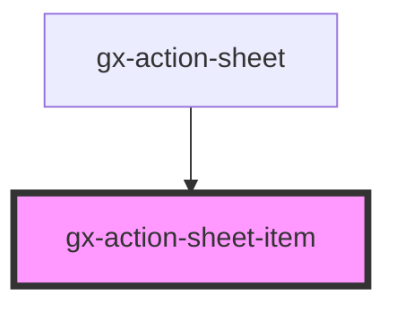

# gx-action-sheet-item

This component allows showing an action in a `gx-action-sheet` component.

```
<gx-action-sheet>
    <gx-action-sheet-item action-type="destructive">Delete</gx-action-sheet-item>
    <gx-action-sheet-item>Share</gx-action-sheet-item>
    <gx-action-sheet-item>Play</gx-action-sheet-item>
    <gx-action-sheet-item>Favorite</gx-action-sheet-item>
    <gx-action-sheet-item action-type="cancel">Favorite</gx-action-sheet-item>
</gx-action-sheet>
```

<!-- Auto Generated Below -->

## Properties

| Property     | Attribute     | Description                                                                                                                                                | Type                         | Default     |
| ------------ | ------------- | ---------------------------------------------------------------------------------------------------------------------------------------------------------- | ---------------------------- | ----------- |
| `actionType` | `action-type` | This attribute lets you specify the type of action. `"cancel"` and `"destructive"` are styled differently                                                  | `"default" \| "destructive"` | `"default"` |
| `disabled`   | `disabled`    | This attribute lets you specify if the element is disabled. If disabled, it will not fire any user interaction related event (for example, gxClick event). | `boolean`                    | `false`     |

## Dependencies

### Used by

- [gx-action-sheet](../action-sheet)

### Graph



---

_Built with [StencilJS](https://stenciljs.com/)_
