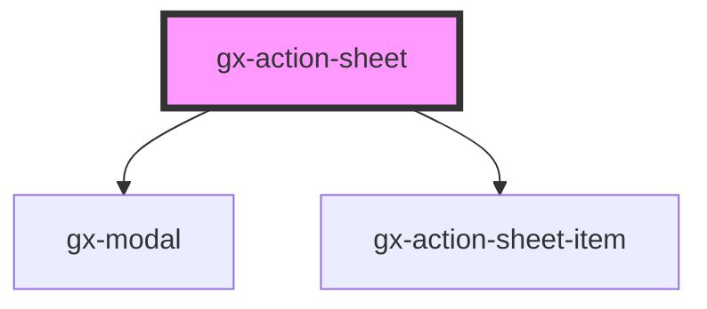

# gx-action-sheet

This component allows showing a modal dialog containing a set of actions (`gx-action-sheet-item` elements). When an action is clicked, the dialog is closed. It can be dismissed using the close button.

```
<gx-action-sheet>
    <gx-action-sheet-item action-type="destructive">Delete</gx-action-sheet-item>
    <gx-action-sheet-item>Share</gx-action-sheet-item>
    <gx-action-sheet-item>Play</gx-action-sheet-item>
    <gx-action-sheet-item>Favorite</gx-action-sheet-item>
    <gx-action-sheet-item action-type="cancel">Favorite</gx-action-sheet-item>
</gx-action-sheet>
```

## Children

It accepts `gx-action-sheet-item` as its child elements.

## Styling with SASS

A SASS mixin called `gx-action-sheet` is provided in `theming/theming-mixins.scss` to ease the styling of this element. See the theming [mixins documentation](/sassdoc/theming-mixins.html.md) for more information.

<!-- Auto Generated Below -->

## Properties

| Property           | Attribute            | Description                                                                                  | Type      | Default     |
| ------------------ | -------------------- | -------------------------------------------------------------------------------------------- | --------- | ----------- |
| `closeButtonLabel` | `close-button-label` | This attribute lets you specify the label for the close button. Important for accessibility. | `string`  | `undefined` |
| `opened`           | `opened`             | This attribute lets you specify if the action sheet is opened or closed.                     | `boolean` | `false`     |

## Events

| Event   | Description                           | Type               |
| ------- | ------------------------------------- | ------------------ |
| `close` | Fired when the action sheet is closed | `CustomEvent<any>` |
| `open`  | Fired when the action sheet is opened | `CustomEvent<any>` |

## CSS Custom Properties

| Name                                  | Description                                      |
| ------------------------------------- | ------------------------------------------------ |
| `--gx-action-sheet-background-color`  | Background color                                 |
| `--gx-action-sheet-border-radius`     | Borders radius                                   |
| `--gx-action-sheet-color`             | Text color                                       |
| `--gx-action-sheet-color-close`       | Close button text color                          |
| `--gx-action-sheet-color-danger`      | Text color for items where `actionType="danger"` |
| `--gx-action-sheet-color-disabled`    | Text color for disabled items                    |
| `--gx-action-sheet-item-border-color` | Color for the bottom border of items             |
| `--gx-action-sheet-padding`           | Padding                                          |
| `--gx-action-sheet-shadow`            | Box shadow                                       |

## Dependencies

### Depends on

- [gx-modal](../modal)
- [gx-action-sheet-item](../action-sheet-item)

### Graph



---

_Built with [StencilJS](https://stenciljs.com/)_
