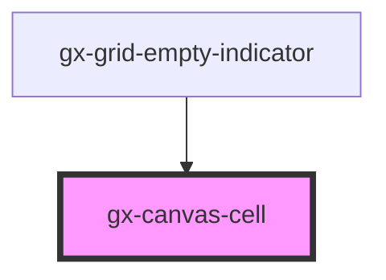

# gx-canvas-cell

A cell for the [gx-canvas](../canvas/readme.md) component

<!-- Auto Generated Below -->

## Properties

| Property       | Attribute       | Description                                                                                                                                                                                                                                                                                                                        | Type                            | Default     |
| -------------- | --------------- | ---------------------------------------------------------------------------------------------------------------------------------------------------------------------------------------------------------------------------------------------------------------------------------------------------------------------------------- | ------------------------------- | ----------- |
| `align`        | `align`         | Defines the horizontal aligmnent of the content of the cell.                                                                                                                                                                                                                                                                       | `"center" \| "left" \| "right"` | `"left"`    |
| `overflowMode` | `overflow-mode` | This attribute defines how the control behaves when the content overflows. \| Value \| Details \| \| -------- \| ----------------------------------------------------------- \| \| `scroll` \| The overflowin content is hidden, but scrollbars are shown \| \| `clip` \| The overflowing content is hidden, without scrollbars \| | `"clip" \| "scroll"`            | `undefined` |
| `valign`       | `valign`        | Defines the vertical aligmnent of the content of the cell.                                                                                                                                                                                                                                                                         | `"bottom" \| "medium" \| "top"` | `"top"`     |

## Dependencies

### Used by

- [gx-grid-empty-indicator](../grid-empty-indicator)

### Graph

---

_Built with [StencilJS](https://stenciljs.com/)_
