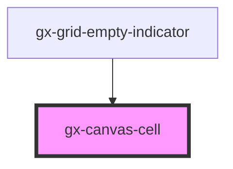

# gx-canvas-cell

A cell for the [gx-canvas](../canvas/readme.md) component

<!-- Auto Generated Below -->

## Properties

| Property       | Attribute       | Description                                                                                                                                                                                                                                                                                                                        | Type                            | Default     |
| -------------- | --------------- | ---------------------------------------------------------------------------------------------------------------------------------------------------------------------------------------------------------------------------------------------------------------------------------------------------------------------------------- | ------------------------------- | ----------- |
| `align`        | `align`         | Defines the horizontal aligmnent of the content of the cell.                                                                                                                                                                                                                                                                       | `"center" \| "left" \| "right"` | `"left"`    |
| `left`         | `left`          | Defines the left position of the control which is relative to the position of its `gx-canvas` container. This attribute maps directly to the `left` CSS property.                                                                                                                                                                  | `string`                        | `null`      |
| `maxHeight`    | `max-height`    | This attribute defines the maximum height of the cell.                                                                                                                                                                                                                                                                             | `string`                        | `null`      |
| `minHeight`    | `min-height`    | This attribute defines the minimum height of the cell when its contents are visible.                                                                                                                                                                                                                                               | `string`                        | `null`      |
| `overflowMode` | `overflow-mode` | This attribute defines how the control behaves when the content overflows. \| Value \| Details \| \| -------- \| ----------------------------------------------------------- \| \| `scroll` \| The overflowin content is hidden, but scrollbars are shown \| \| `clip` \| The overflowing content is hidden, without scrollbars \| | `"clip" \| "scroll"`            | `undefined` |
| `top`          | `top`           | Defines the top position of the control which is relative to the position of its `gx-canvas` container. This attribute maps directly to the `top` CSS property.                                                                                                                                                                    | `string`                        | `null`      |
| `valign`       | `valign`        | Defines the vertical alignment of the content of the cell.                                                                                                                                                                                                                                                                         | `"bottom" \| "medium" \| "top"` | `"top"`     |
| `width`        | `width`         | This attribute lets you specify the width of the control.                                                                                                                                                                                                                                                                          | `string`                        | `undefined` |

## Dependencies

### Used by

- [gx-grid-empty-indicator](../grid-empty-indicator)

### Graph

---

_Built with [StencilJS](https://stenciljs.com/)_
