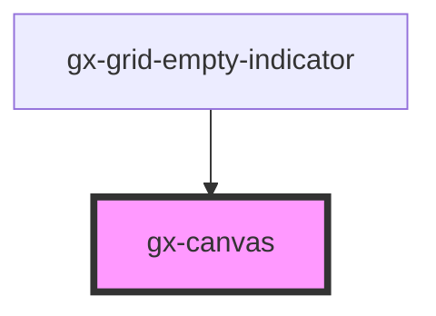

# gx-canvas

A container for creating absolute positioned layouts.

<!-- Auto Generated Below -->

## Properties

| Property        | Attribute        | Description                                                                                                                                                                                                                                                                                                                                                                                  | Type                         | Default      |
| --------------- | ---------------- | -------------------------------------------------------------------------------------------------------------------------------------------------------------------------------------------------------------------------------------------------------------------------------------------------------------------------------------------------------------------------------------------- | ---------------------------- | ------------ |
| `disabled`      | `disabled`       | This attribute lets you specify if the element is disabled. If disabled, it will not fire any user interaction related event (for example, click event).                                                                                                                                                                                                                                     | `boolean`                    | `false`      |
| `invisibleMode` | `invisible-mode` | This attribute lets you specify how this element will behave when hidden. \| Value \| Details \| \| ------------ \| --------------------------------------------------------------------------- \| \| `keep-space` \| The element remains in the document flow, and it does occupy space. \| \| `collapse` \| The element is removed form the document flow, and it doesn't occupy space. \| | `"collapse" \| "keep-space"` | `"collapse"` |
| `minHeight`     | `min-height`     | This attribute defines the minimum height of the cell when its contents are visible.                                                                                                                                                                                                                                                                                                         | `string`                     | `null`       |
| `width`         | `width`          | This attribute lets you specify the width of the control.                                                                                                                                                                                                                                                                                                                                    | `string`                     | `undefined`  |

## Events

| Event        | Description                                             | Type               |
| ------------ | ------------------------------------------------------- | ------------------ |
| `gxClick`    | Emitted when the element is clicked.                    | `CustomEvent<any>` |
| `swipe`      | Emitted when the element is swiped.                     | `CustomEvent<any>` |
| `swipeDown`  | Emitted when the element is swiped downward direction.  | `CustomEvent<any>` |
| `swipeLeft`  | Emitted when the element is swiped left direction.      | `CustomEvent<any>` |
| `swipeRight` | Emitted when the element is swiped right direction.     | `CustomEvent<any>` |
| `swipeUp`    | Emitted when the element is swiped in upward direction. | `CustomEvent<any>` |

## Methods

### `setObserver() => Promise<void>`

If the layout is loaded and the `gx-canvas` control has at least one
`gx-canvas-cell` with autoGrow == True (maxHeight == null), this method
will set the observers to implement autoGrow in the `gx-canvas` control.

#### Returns

Type: `Promise<void>`

## Dependencies

### Used by

- [gx-grid-empty-indicator](../grid-empty-indicator)

### Graph

---

_Built with [StencilJS](https://stenciljs.com/)_
