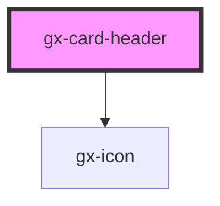

# gx-card-header

A content container designed to be used as the menu header of the gx-card
control and with the ability to render `gx-button`, `gx-textblock` or other
actionable elements in specific areas, according to their priority.

## Example

```html
<style>
  .ApplicationBarFancyClass {
    background-color: #8082b3;
    color: #ffffff;
    font-size: 18px;
    font-weight: 500;

    /* 
    @include gx-navbar(
      $default-button: ".DefaultButton",
      $back-button: ".BackButton"
    );
    */
  }
</style>

<gx-card>
  <gx-card-header slot="header" css-class="ApplicationBarFancyClass">
    <li slot="high-priority-action">
      <gx-button>Share</gx-button>
    </li>

    <li slot="normal-priority-action">
      <gx-button>Save</gx-button>
    </li>

    <li slot="normal-priority-action">
      <gx-button>Cancel</gx-button>
    </li>

    <li slot="low-priority-action">
      <gx-textblock href="#">Action</gx-textblock>
    </li>

    <li slot="low-priority-action">
      <gx-textblock href="#"> Another action </gx-textblock>
    </li>

    <li slot="low-priority-action">
      <gx-textblock href="#"> Something else here </gx-textblock>
    </li>
  </gx-card-header>
</gx-card>
```

<!-- Auto Generated Below -->

## Properties

| Property                  | Attribute                    | Description                                                                                                        | Type     | Default     |
| ------------------------- | ---------------------------- | ------------------------------------------------------------------------------------------------------------------ | -------- | ----------- |
| `actionToggleButtonLabel` | `action-toggle-button-label` | This attribute lets you specify the label for the low priority actions toggle button. Important for accessibility. | `string` | `undefined` |
| `cssClass`                | `css-class`                  | A CSS class to set for the header and footer element classes of the `gx-card` control.                             | `string` | `undefined` |

## Slots

| Slot                       | Description                                                                                                                                 |
| -------------------------- | ------------------------------------------------------------------------------------------------------------------------------------------- |
| `"high-priority-action"`   | This slot will be rendered as a high priority action of the card-header. High priority actions are rendered left aligned.                   |
| `"low-priority-action"`    | This slot will be rendered as a low priority action of the card-header. Low priority actions are rendered inside a right aligned drop down. |
| `"normal-priority-action"` | This slot will be rendered as a normal priority action of the card-header. Normal priority actions are rendered right aligned.              |

## Shadow Parts

| Part                     | Description                                                                                                                 |
| ------------------------ | --------------------------------------------------------------------------------------------------------------------------- |
| `"list-of-actions"`      | The container for the list of actions.                                                                                      |
| `"low-actions-dropdown"` | The dropdown displayed on the right side of the control when clicking the "show more" button (`"low-actions-toggle"` part). |
| `"low-actions-toggle"`   | The "show more" button displayed on the right side of the control when the navbar has low priority actions.                 |
| `"nav"`                  | The `<nav>` container of the control. It contains the container for the list of actions (`"list-of-actions"` part).         |

## Dependencies

### Depends on

- [gx-icon](../icon)

### Graph



---

_Built with [StencilJS](https://stenciljs.com/)_
