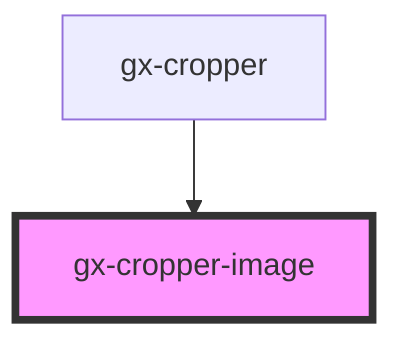

# gx-cropper-image

Cropper image visualization

<!-- Auto Generated Below -->

## Properties

| Property | Attribute | Description                  | Type            | Default     |
| -------- | --------- | ---------------------------- | --------------- | ----------- |
| `size`   | --        | The size for crop the image. | `GxCropperSize` | `undefined` |
| `src`    | `src`     | The source of the image.     | `string`        | `undefined` |

## Events

| Event                   | Description                                          | Type                                     |
| ----------------------- | ---------------------------------------------------- | ---------------------------------------- |
| `gxCropperImageChanged` | Fired when the image has changed it size nor scale . | `CustomEvent<GxCropperImageChangeEvent>` |
| `gxCropperImageLoaded`  | Fired when the image has finished load.              | `CustomEvent<any>`                       |

## Methods

### `changeWhenScroll(depth: boolean) => Promise<void>`

#### Returns

Type: `Promise<void>`

### `moveImage(left: number, top: number) => Promise<void>`

#### Returns

Type: `Promise<void>`

## Dependencies

### Used by

- [gx-cropper](../gx-cropper)

### Graph

---

_Built with [StencilJS](https://stenciljs.com/)_
