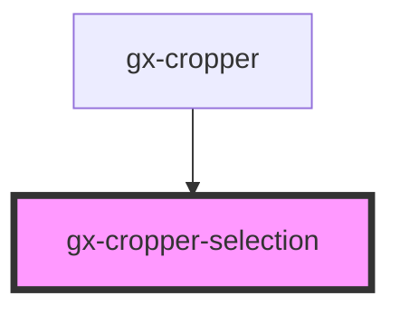

# gx-cropper-selection

Cropper selector

<!-- Auto Generated Below -->

## Properties

| Property             | Attribute              | Description                                       | Type            | Default     |
| -------------------- | ---------------------- | ------------------------------------------------- | --------------- | ----------- |
| `respectAspectRatio` | `respect-aspect-ratio` | Respect aspect ratio of width and height.         | `boolean`       | `true`      |
| `showInside`         | `show-inside`          | Show or not the grid inside the selector cropper. | `boolean`       | `false`     |
| `size`               | --                     | The size for crop the image.                      | `GxCropperSize` | `undefined` |

## Events

| Event                        | Description                                      | Type                                           |
| ---------------------------- | ------------------------------------------------ | ---------------------------------------------- |
| `gxCropperSelectionIncrease` | Fired when the selector increases it dimentions. | `CustomEvent<GxCropperSelectionIncreaseEvent>` |

## Shadow Parts

| Part                | Description |
| ------------------- | ----------- |
| `"selector-inside"` |             |

## Dependencies

### Used by

- [gx-cropper](../gx-cropper)

### Graph

---

_Built with [StencilJS](https://stenciljs.com/)_
