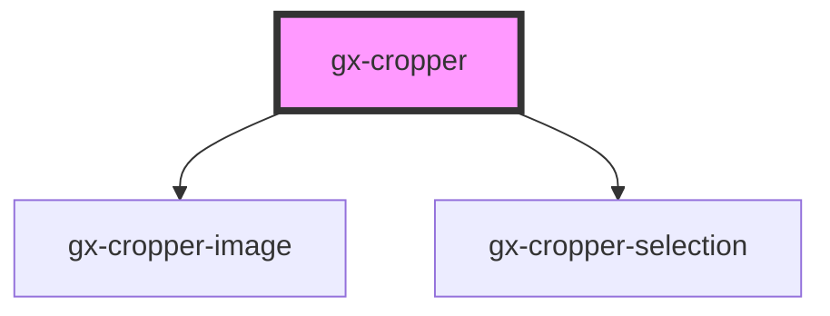

# GX Cropper

This is a tool for crop images.

### Example

```html
<gx-cropper
  src="some_image.jpg"
  width="200"
  height="200"
  show-behavior="inline"
></gx-cropper>
<button onclick="getImage()">Obtener Imagen</button>

<script>
  let cropper = null;
  window.addEventListener(
    "load",
    () => {
      cropper = document.getElementsByTagName("gx-cropper")[0];
    },
    false
  );

  function getImage() {
    if (cropper) {
      cropper.getLastCropImage().then(dataurl => {
        // #preview is a 
        document.getElementById("preview").src = dataurl;
      });
    }
  }
</script>
```

<!-- Auto Generated Below -->

## Properties

| Property       | Attribute       | Description                                           | Type                  | Default                |
| -------------- | --------------- | ----------------------------------------------------- | --------------------- | ---------------------- |
| `cssClass`     | `css-class`     | A CSS class to set as the `gx-cropper` element class. | `string`              | `undefined`            |
| `height`       | `height`        | The source for crop the image.                        | `number`              | `CROPPER_INITIAL_SIZE` |
| `showBehavior` | `show-behavior` | How the cropper will be show.                         | `"inline" \| "popup"` | `"inline"`             |
| `src`          | `src`           | The source of the image.                              | `string`              | `undefined`            |
| `started`      | `started`       | If the showBehavior is popup, calculate dimensions.   | `boolean`             | `false`                |
| `width`        | `width`         | The width for crop the image.                         | `number`              | `CROPPER_INITIAL_SIZE` |

## Events

| Event                    | Description                                          | Type                  |
| ------------------------ | ---------------------------------------------------- | --------------------- |
| `gxCropperImageExported` | Fired when the image has changed it size nor scale . | `CustomEvent<string>` |

## Methods

### `getLastCropImage() => Promise<string>`

Get the cropped image.

#### Returns

Type: `Promise<string>`

## Shadow Parts

| Part                  | Description                          |
| --------------------- | ------------------------------------ |
| `"body"`              | The body of the popup of gx-cropper. |
| `"cropper-container"` | The container of gx-cropper.         |
| `"cropper-image"`     | Where reside the image.              |
| `"cropper-selection"` | The selection tool of gx-cropper.    |

## Dependencies

### Depends on

- [gx-cropper-image](../cropper-image)
- [gx-cropper-selection](../cropper-selection)

### Graph



---

_Built with [StencilJS](https://stenciljs.com/)_
