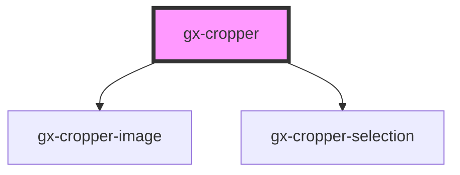

# GX Cropper

This is a cropper of images for genexus.

### Node Modules

- Run `npm install gx-cropper --save`
- Then you can use the element anywhere in your template, JSX, html etc

### Example

```html
<gx-cropper
  src="http://somesite.com/images/some_image.jpg"
  width="200"
  height="200"
  show-behavior="inline"
>
  <span slot="header">Recortar imagen</span>
  <button slot="primary-action" onclick="getImage()">Obtener Imagen</button>
</gx-cropper>

<script>
  let cropper = null;
  window.addEventListener(
    "load",
    () => {
      cropper = document.getElementsByTagName("gx-cropper")[0];
    },
    false
  );

  function getImage() {
    if (cropper) {
      cropper.getLastCropImage().then(dataurl => {
        // #preview is a 
        document.getElementById("preview").src = dataurl;
      });
    }
  }
</script>
```

<!-- Auto Generated Below -->

## Properties

| Property           | Attribute            | Description                                                                                     | Type                  | Default                |
| ------------------ | -------------------- | ----------------------------------------------------------------------------------------------- | --------------------- | ---------------------- |
| `autoClose`        | `auto-close`         | This attribute lets you specify if the popup is automatically closed when an action is clicked. | `boolean`             | `undefined`            |
| `closeButtonLabel` | `close-button-label` | This attribute lets you specify the label for the close button. Important for accessibility.    | `string`              | `undefined`            |
| `cssClass`         | `css-class`          | A CSS class to set as the `gx-cropper` element class.                                           | `string`              | `undefined`            |
| `height`           | `height`             | The source for crop the image.                                                                  | `number`              | `CROPPER_INITIAL_SIZE` |
| `opened`           | `opened`             | If the showBehavior is popup, this attribute lets you specify if the popup is opened or closed. | `boolean`             | `false`                |
| `popupHeight`      | `popup-height`       | This attribute lets you specify the height of the popup.                                        | `string`              | `null`                 |
| `popupWidth`       | `popup-width`        | This attribute lets you specify the width of the popup.                                         | `string`              | `null`                 |
| `showBehavior`     | `show-behavior`      | How the cropper will be show.                                                                   | `"inline" \| "popup"` | `'inline'`             |
| `showFooter`       | `show-footer`        | This attribute lets you specify if a footer is rendered at the bottom of the popup.             | `boolean`             | `true`                 |
| `showHeader`       | `show-header`        | This attribute lets you specify if a header is rendered on top of the popup.                    | `boolean`             | `true`                 |
| `src`              | `src`                | The source of the image.                                                                        | `string`              | `undefined`            |
| `width`            | `width`              | The width for crop the image.                                                                   | `number`              | `CROPPER_INITIAL_SIZE` |

## Events

| Event                    | Description                                          | Type                  |
| ------------------------ | ---------------------------------------------------- | --------------------- |
| `gxCropperImageExported` | Fired when the image has changed it size nor scale . | `CustomEvent<string>` |
| `gxCropperPopupClose`    | Fired when the popup is closed                       | `CustomEvent<any>`    |
| `gxCropperPopupOpen`     | Fired when the popup is opened                       | `CustomEvent<any>`    |

## Methods

### `getLastCropImage() => Promise<string>`

#### Returns

Type: `Promise<string>`

## Shadow Parts

| Part                  | Description |
| --------------------- | ----------- |
| `"body"`              |             |
| `"close-button"`      |             |
| `"cropper-container"` |             |
| `"cropper-image"`     |             |
| `"cropper-selection"` |             |
| `"footer"`            |             |
| `"header"`            |             |

## Dependencies

### Depends on

- [gx-cropper-image](../gx-cropper-image)
- [gx-cropper-selection](../gx-cropper-selection)

### Graph



---

_Built with [StencilJS](https://stenciljs.com/)_
