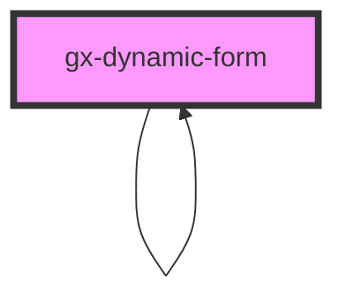

# dynamic-form

An element for generate dynamic forms.
You can define a set of elements and rules that they must follow

## Example

```HTML
    <gx-dynamic-form elements='[{"id":1,"version":1,"name":"Example form","Elements":[{"id":1,"version":1,"name":"Name","type":"character","display":"default","value":"","dftValue":"","regex":"","length":20,"rows":0,"cols":0,"Values":[]},{"id":2,"version":1,"name":"Lastname","type":"character","display":"default","value":"","dftValue":"","regex":"","length":20,"rows":0,"cols":0,"Values":[]},{"id":3,"version":1,"name":"Age","type":"numeric","display":"default","value":"","dftValue":"","regex":"","length":4,"rows":0,"cols":0,"Values":[],"Rules":[{"id":1,"function":"error","Conditions":[{"id":1,"cndElemId":3,"operator":5,"cndValue":"18","cndEval":0}]}]}]}]' readonly="true" subgroup="false" input-css-class="Attribute" error-css-class="ErrorAttribute" warning-css-class="WarningAttribute" point="example/entrypoint">
    </gx-dynamic-form>
```

<!-- Auto Generated Below -->

## Properties

| Property          | Attribute           | Description                                                                                                                            | Type      | Default     |
| ----------------- | ------------------- | -------------------------------------------------------------------------------------------------------------------------------------- | --------- | ----------- |
| `elements`        | `elements`          | This attribute let you specify the elements, rules and conditions of the dynamic form. Must be a JSON string, based on DynamicForm SDT | `string`  | `undefined` |
| `errorCssClass`   | `error-css-class`   | A css class to set to attributes when a error occurs                                                                                   | `string`  | `undefined` |
| `inputCssClass`   | `input-css-class`   | A css class to set to attributes                                                                                                       | `string`  | `undefined` |
| `readonly`        | `readonly`          | This attribute let you specify if the dynamic form is readonly                                                                         | `boolean` | `false`     |
| `subgroup`        | `subgroup`          | This attribute let you specify if this dynamic form is a subgroup of another dynamic form                                              | `boolean` | `false`     |
| `warningCssClass` | `warning-css-class` | A css class to set to attributes when a warning occurs                                                                                 | `string`  | `undefined` |

## Events

| Event          | Description                        | Type               |
| -------------- | ---------------------------------- | ------------------ |
| `onMessage`    | Emitted when a message is shown    | `CustomEvent<any>` |
| `onSubmitForm` | Emitted when the form is submitted | `CustomEvent<any>` |

## Dependencies

### Used by

- [gx-dynamic-form](.)

### Depends on

- [gx-form-field](../form-field)
- [gx-edit](../edit)
- [gx-radio-group](../radio-group)
- [gx-radio-option](../radio-option)
- [gx-dynamic-form](.)
- [gx-select](../select)
- [gx-select-option](../select-option)
- [gx-checkbox](../checkbox)
- [gx-switch](../switch)

### Graph



---

_Built with [StencilJS](https://stenciljs.com/)_
