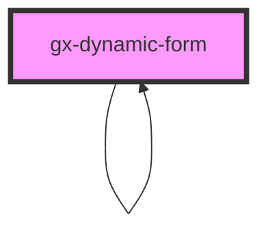

# dynamic-form

<!-- Auto Generated Below -->

## Properties

| Property          | Attribute           | Description                                                                                                                            | Type      | Default     |
| ----------------- | ------------------- | -------------------------------------------------------------------------------------------------------------------------------------- | --------- | ----------- |
| `elements`        | `elements`          | This attribute let you specify the elements, rules and conditions of the dynamic form. Must be a JSON string, based on DynamicForm SDT | `string`  | `undefined` |
| `errorCssClass`   | `error-css-class`   | A css class to set to attributes when a error occurs                                                                                   | `string`  | `undefined` |
| `inputCssClass`   | `input-css-class`   | A css class to set to attributes                                                                                                       | `string`  | `undefined` |
| `point`           | `point`             | This attribute let you specify the entry point to upload files                                                                         | `string`  | `undefined` |
| `readonly`        | `readonly`          | This attribute let you specify if the dynamic form is readonly                                                                         | `boolean` | `false`     |
| `subgroup`        | `subgroup`          | This attribute let you specify if this dynamic form is a subgroup of another dynamic form                                              | `boolean` | `false`     |
| `warningCssClass` | `warning-css-class` | A css class to set to attributes when a warning occurs                                                                                 | `string`  | `undefined` |

## Events

| Event          | Description                       | Type               |
| -------------- | --------------------------------- | ------------------ |
| `onSubmitForm` | Emited when the form is submitted | `CustomEvent<any>` |

## Dependencies

### Used by

 - [gx-dynamic-form](.)

### Depends on

- [gx-form-field](../form-field)
- [gx-edit](../edit)
- [gx-radio-group](../radio-group)
- [gx-radio-option](../radio-option)
- [gx-dynamic-form](.)
- [gx-select](../select)
- [gx-select-option](../select-option)
- [gx-checkbox](../checkbox)
- [gx-switch](../switch)

### Graph

----------------------------------------------

*Built with [StencilJS](https://stenciljs.com/)*
