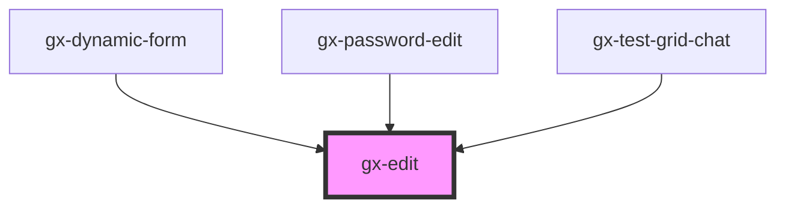

# gx-edit

An edit box with an optional trigger button.

## Children

If a child element with the attribute area="trigger-content" is found, this content will be used as the trigger content.

```html
<gx-edit value="my value" show-trigger label-caption="Password" placeholder="Enter the password...">
  </img>
</gx-edit>
```

```html
<gx-edit value="my value" show-trigger placeholder="Search">
  <i class="fa fa-search" slot="trigger-content"></i>
</gx-edit>
```

## Styling with SASS

A SASS mixin called `gx-edit` is provided in `theming/theming-mixins.scss` to ease the styling of this element. See the theming [mixins documentation](/sassdoc/theming-mixins.html.md) for more information.

<!-- Auto Generated Below -->

## Properties

| Property             | Attribute              | Description                                                                                                                                                                                                                                                                                                                                                                                          | Type                                                                                                                          | Default     |
| -------------------- | ---------------------- | ---------------------------------------------------------------------------------------------------------------------------------------------------------------------------------------------------------------------------------------------------------------------------------------------------------------------------------------------------------------------------------------------------- | ----------------------------------------------------------------------------------------------------------------------------- | ----------- |
| `accessibleName`     | `accessible-name`      | Specifies a short string, typically 1 to 3 words, that authors associate with an element to provide users of assistive technologies with a label for the element. Only works if `readonly="false"` and `format="Text"`.                                                                                                                                                                              | `string`                                                                                                                      | `undefined` |
| `area`               | `area`                 | Allows to specify the role of the element when inside a `gx-form-field` element                                                                                                                                                                                                                                                                                                                      | `"field"`                                                                                                                     | `undefined` |
| `autocapitalize`     | `autocapitalize`       | Specifies the auto-capitalization behavior. Same as [autocapitalize](https://developer.apple.com/library/content/documentation/AppleApplications/Reference/SafariHTMLRef/Articles/Attributes.html#//apple_ref/doc/uid/TP40008058-autocapitalize) attribute for `input` elements. Only supported by Safari and Chrome.                                                                                | `string`                                                                                                                      | `undefined` |
| `autocomplete`       | `autocomplete`         | This attribute indicates whether the value of the control can be automatically completed by the browser. Same as [autocomplete](https://developer.mozilla.org/en-US/docs/Web/HTML/Element/input#attr-autocomplete) attribute for `input` elements.                                                                                                                                                   | `"off" \| "on"`                                                                                                               | `undefined` |
| `autocorrect`        | `autocorrect`          | Used to control whether autocorrection should be enabled when the user is entering/editing the text value. Sames as [autocorrect](https://developer.mozilla.org/en-US/docs/Web/HTML/Element/input#attr-autocorrect) attribute for `input` elements.                                                                                                                                                  | `string`                                                                                                                      | `undefined` |
| `cssClass`           | `css-class`            | A CSS class to set as the `gx-edit` element class.                                                                                                                                                                                                                                                                                                                                                   | `string`                                                                                                                      | `undefined` |
| `disabled`           | `disabled`             | This attribute lets you specify if the element is disabled. If disabled, it will not fire any user interaction related event (for example, click event).                                                                                                                                                                                                                                             | `boolean`                                                                                                                     | `false`     |
| `fontCategory`       | `font-category`        | Used to define the semantic of the element when `readonly="true"`.                                                                                                                                                                                                                                                                                                                                   | `"h1" \| "h2" \| "h3" \| "h4" \| "h5" \| "h6" \| "p"`                                                                         | `"p"`       |
| `format`             | `format`               | It specifies the format that will have the edit control. If `format` = `HTML`, the edit control works as an HTML div and the innerHTML will be the same as the `inner` property specifies. Also, it does not allow any input/editable UI since it works as an HTML div. If `format` = `Text`, the edit control works as a normal input control and it is affected by most of the defined properties. | `"HTML" \| "Text"`                                                                                                            | `"Text"`    |
| `highlightable`      | `highlightable`        | True to highlight control when an action is fired.                                                                                                                                                                                                                                                                                                                                                   | `boolean`                                                                                                                     | `false`     |
| `lineClamp`          | `line-clamp`           | True to cut text when it overflows, showing an ellipsis (only applies when readonly)                                                                                                                                                                                                                                                                                                                 | `boolean`                                                                                                                     | `false`     |
| `maxLength`          | `max-length`           | This property defines the maximum string length that the user can enter into the control. Only works when `readonly === false` and `format === "Text"`.                                                                                                                                                                                                                                              | `number`                                                                                                                      | `undefined` |
| `mode`               | `mode`                 | This attribute hints at the type of data that might be entered by the user while editing the element or its contents. This allows a browser to display an appropriate virtual keyboard. Only works when `readonly === false`, `multiline === false` and `format === "Text"`.                                                                                                                         | `"decimal" \| "email" \| "none" \| "numeric" \| "search" \| "tel" \| "text" \| "url"`                                         | `undefined` |
| `multiline`          | `multiline`            | Controls if the element accepts multiline text.                                                                                                                                                                                                                                                                                                                                                      | `boolean`                                                                                                                     | `undefined` |
| `pattern`            | `pattern`              | This attribute specifies a regular expression the form control's value should match. Only works when `readonly === false`, `multiline === false` and `format === "Text"`.                                                                                                                                                                                                                            | `string`                                                                                                                      | `undefined` |
| `picture`            | `picture`              | Specifies a picture to apply for the value of the control. Only works if `format === "Text"`, `type === "Text"` and `mode === "numeric"`.                                                                                                                                                                                                                                                            | `string`                                                                                                                      | `undefined` |
| `placeholder`        | `placeholder`          | A hint to the user of what can be entered in the control. Same as [placeholder](https://developer.mozilla.org/en-US/docs/Web/HTML/Element/input#attr-placeholder) attribute for `input` elements.                                                                                                                                                                                                    | `string`                                                                                                                      | `undefined` |
| `readonly`           | `readonly`             | This attribute indicates that the user cannot modify the value of the control. Same as [readonly](https://developer.mozilla.org/en-US/docs/Web/HTML/Element/input#attr-readonly) attribute for `input` elements.                                                                                                                                                                                     | `boolean`                                                                                                                     | `undefined` |
| `showTrigger`        | `show-trigger`         | If true, a trigger button is shown next to the edit field. The button can be customized adding a child element with `slot="trigger-content"` attribute to specify the content inside the trigger button.                                                                                                                                                                                             | `boolean`                                                                                                                     | `undefined` |
| `triggerButtonLabel` | `trigger-button-label` | This attribute lets you specify the label for the trigger button. Important for accessibility.                                                                                                                                                                                                                                                                                                       | `string`                                                                                                                      | `undefined` |
| `type`               | `type`                 | The type of control to render. A subset of the types supported by the `input` element is supported: _ `"date"` _ `"datetime-local"` _ `"email"` _ `"file"` _ `"number"` _ `"password"` _ `"search"` _ `"tel"` _ `"text"` _ `"url"`                                                                                                                                                                   | `"date" \| "datetime-local" \| "email" \| "file" \| "number" \| "password" \| "search" \| "tel" \| "text" \| "time" \| "url"` | `"text"`    |
| `value`              | `value`                | The initial value of the control.                                                                                                                                                                                                                                                                                                                                                                    | `string`                                                                                                                      | `undefined` |

## Events

| Event            | Description                                                                                                                                                                                                                                | Type               |
| ---------------- | ------------------------------------------------------------------------------------------------------------------------------------------------------------------------------------------------------------------------------------------ | ------------------ |
| `change`         | The `change` event is emitted when a change to the element's value is committed by the user. Unlike the `input` event, the `change` event is not necessarily fired for each change to an element's value but when the control loses focus. | `CustomEvent<any>` |
| `gxTriggerClick` | The `gxTriggerClick` event is fired when the trigger button is clicked.                                                                                                                                                                    | `CustomEvent<any>` |
| `input`          | The `input` event is fired synchronously when the value is changed.                                                                                                                                                                        | `CustomEvent<any>` |

## Methods

### `getNativeInputId() => Promise<string>`

Returns the id of the inner `input` element (if set).

#### Returns

Type: `Promise<string>`

## Slots

| Slot                | Description                                          |
| ------------------- | ---------------------------------------------------- |
|                     | The slot for the html content when `format="HTML"`.  |
| `"trigger-content"` | The slot used for the content of the trigger button. |

## Shadow Parts

| Part                          | Description                                                                                                                                                       |
| ----------------------------- | ----------------------------------------------------------------------------------------------------------------------------------------------------------------- |
| `"gx-edit__content"`          | The main content displayed in the control. This part only applies when `format="Text"`.                                                                           |
| `"gx-edit__date-placeholder"` | A placeholder displayed when the control is editable (`readonly="false"`), has no value set, and its type is `"datetime-local" \| "date" \| "time"`.              |
| `"gx-edit__hidden-multiline"` | The auxiliary content rendered in the control to implement the auto-grow. This part only applies when `format="Text"`, `multiline="true"` and `readonly="false"`. |
| `"gx-edit__html-container"`   | The container of the main content displayed in the control. This part only applies when `format="HTML"`.                                                          |
| `"gx-edit__html-content"`     | The main content displayed in the control. This part only applies when `format="HTML"`.                                                                           |
| `"gx-edit__trigger-button"`   | The trigger button displayed on the right side of the control when `show-trigger="true"`.                                                                         |

## CSS Custom Properties

| Name                                   | Description                                                                    |
| -------------------------------------- | ------------------------------------------------------------------------------ |
| `--gx-edit-auto-fill-background-color` | Define the background color when the edit is auto filled. (#e8f0fe by default) |

## Dependencies

### Used by

- [gx-dynamic-form](../dynamic-form)
- [gx-password-edit](../password-edit)
- [gx-test-grid-chat](../test/test-grid-chat)

### Graph



---

_Built with [StencilJS](https://stenciljs.com/)_
