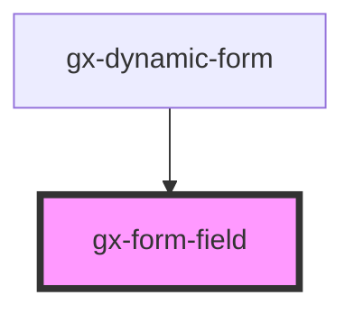

# gx-form-field

This control allows showing a label for a form custom control. The label's position can be controlled with the `label-position` attribute.

```html
<gx-form-field label-caption="User" label-position="top">
  <gx-edit id="edit1" value="" area="field"></gx-edit>
</gx-form-field>
```

## Children

In most cases, there must be a form custom element as a child with the `area` attribute set to `"field"`.

An "edit" custom element can be on of these:

- `gx-checkbox`

- `gx-chronometer`

- `gx-edit`

- `gx-gauge`

- `gx-password-edit`

- `gx-radio-group`

- `gx-rating`

- `gx-select`

- `gx-switch`

The child element should have and id specified, so the inner `label` element rendered uses it in its `for` attribute.

## Styling with SASS

A SASS mixin called `gx-form-field` is provided in `./_form-field-label-theming-mixins.scss` to ease the styling of this element. See the theming [mixins documentation](/sassdoc/theming-mixins.html.md) for more information.

<!-- Auto Generated Below -->

## Properties

| Property        | Attribute        | Description                                                                                                                                                                                                                                                                                                                                                                                                                                                                                                                                                                                        | Type                                                          | Default      |
| --------------- | ---------------- | -------------------------------------------------------------------------------------------------------------------------------------------------------------------------------------------------------------------------------------------------------------------------------------------------------------------------------------------------------------------------------------------------------------------------------------------------------------------------------------------------------------------------------------------------------------------------------------------------- | ------------------------------------------------------------- | ------------ |
| `cssClass`      | `css-class`      | A CSS class to set as the `gx-form-field` label element class. This property must match with the `cssClass` used by the inner control. Therefore, to style the `gx-form-field` label, the control applies some transformations to the label to get the appropriate classes.                                                                                                                                                                                                                                                                                                                        | `string`                                                      | `null`       |
| `invisibleMode` | `invisible-mode` | This attribute lets you specify how this element will behave when hidden. \| Value \| Details \| \| ------------ \| --------------------------------------------------------------------------- \| \| `keep-space` \| The element remains in the document flow, and it does occupy space. \| \| `collapse` \| The element is removed form the document flow, and it doesn't occupy space. \|                                                                                                                                                                                                       | `"collapse" \| "keep-space"`                                  | `"collapse"` |
| `labelCaption`  | `label-caption`  | The text to set as the label of the field.                                                                                                                                                                                                                                                                                                                                                                                                                                                                                                                                                         | `string`                                                      | `undefined`  |
| `labelPosition` | `label-position` | The position where the label will be located, relative to the edit control. The supported values are: _ `"top"`: The label is located above the edit control. _ `"right"`: The label is located at the right side of the edit control. _ `"bottom"`: The label is located below the edit control. _ `"left"`: The label is located at the left side of the edit control. _ `"float"`: The label is shown as a placeholder when the edit control's value is empty. When the value is not empty, the label floats and locates above the edit control. _ `"none"`: The label is rendered, but hidden. | `"bottom" \| "float" \| "left" \| "none" \| "right" \| "top"` | `undefined`  |

## CSS Custom Properties

| Name                                 | Description                                                                        |
| ------------------------------------ | ---------------------------------------------------------------------------------- |
| `--gx-form-field-label-width-column` | Define the label width when the label position is left or right. (100% by default) |
| `--gx-form-field-label-width-row`    | Define the label width when the label position is top or bottom. (100% by default) |

## Dependencies

### Used by

- [gx-dynamic-form](../dynamic-form)

### Graph



---

_Built with [StencilJS](https://stenciljs.com/)_
