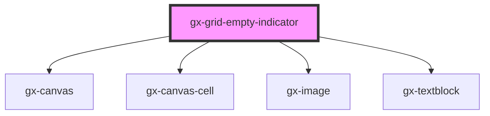

# gx-grid-empty-indicator

This control shows a text element with an image in the background. It also supports a class for text and background image.

```html
<gx-grid-empty-indicator
  text="My Empty Grid Text"
  text-class="MyTextClass"
  image="image.png"
  image-class="MyImageClass"
>
</gx-grid-empty-indicator>
```

<!-- Auto Generated Below -->

## Properties

| Property     | Attribute     | Description | Type | Default |
| ------------ | ------------- | ----------- | ---- | ------- |
| `image`      | `image`       |             | `""` | `""`    |
| `imageClass` | `image-class` |             | `""` | `""`    |
| `text`       | `text`        |             | `""` | `""`    |
| `textClass`  | `text-class`  |             | `""` | `""`    |

## Dependencies

### Depends on

- [gx-canvas](../canvas)
- [gx-canvas-cell](../canvas-cell)
- [gx-image](../image)
- [gx-textblock](../textblock)

### Graph



---

_Built with [StencilJS](https://stenciljs.com/)_
