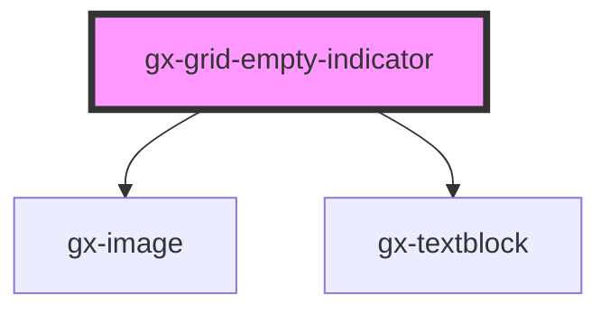

# gx-grid-empty-indicator

This control shows a text element with an image in the background. It also supports a class for text and background image.

```html
<gx-grid-empty-indicator
  text="My Empty Grid Text"
  text-class="MyTextClass"
  image="image.png"
  image-class="MyImageClass"
>
</gx-grid-empty-indicator>
```

<!-- Auto Generated Below -->

## Properties

| Property     | Attribute     | Description                                                                                        | Type      | Default |
| ------------ | ------------- | -------------------------------------------------------------------------------------------------- | --------- | ------- |
| `autoGrow`   | `auto-grow`   | This attribute defines if the control size will grow automatically, to adjust to its content size. | `boolean` | `false` |
| `image`      | `image`       | This attribute lets you specify the `src` of the image to be shown.                                | `""`      | `""`    |
| `imageClass` | `image-class` | A CSS class to set as the inner `image` element class.                                             | `""`      | `""`    |
| `imageSet`   | `image-set`   | This attribute lets you specify the `srcset` of the image to be shown.                             | `""`      | `""`    |
| `text`       | `text`        | Text to be displayed                                                                               | `""`      | `""`    |
| `textClass`  | `text-class`  | A CSS class to set as the inner `text` element class.                                              | `""`      | `""`    |

## Dependencies

### Depends on

- [gx-image](../image)
- [gx-textblock](../textblock)

### Graph



---

_Built with [StencilJS](https://stenciljs.com/)_
