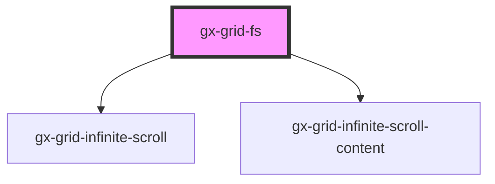

# gx-grid-fs

A container for including a repetitive elements list.
It provides 3 slots:

- `'grid-content'` slot: This slot holds the grid's content
- 'grid-content-empty' slot: This slot will be shown only when the grid is empty.
- 'grid-loading-content': This slot will be shown while the grid is being loaded. Include the loading indicator markup here.

When grid is empty, a CSS Class name 'gx-grid-empty' is added to the host element.
When grid is loading, a CSS Class name 'gx-grid-loading' is added to the host element.

<!-- Auto Generated Below -->

## Properties

| Property        | Attribute        | Description                                                                                                                                                                                                                                                                                                                                                                                                                                                                                       | Type                         | Default      |
| --------------- | ---------------- | ------------------------------------------------------------------------------------------------------------------------------------------------------------------------------------------------------------------------------------------------------------------------------------------------------------------------------------------------------------------------------------------------------------------------------------------------------------------------------------------------- | ---------------------------- | ------------ |
| `invisibleMode` | `invisible-mode` | This attribute lets you specify how this element will behave when hidden. \| Value \| Details \| \| ------------ \| --------------------------------------------------------------------------- \| \| `keep-space` \| The element remains in the document flow, and it does occupy space. \| \| `collapse` \| The element is removed form the document flow, and it doesn't occupy space. \|                                                                                                      | `"collapse" \| "keep-space"` | `"collapse"` |
| `loadingState`  | `loading-state`  | Grid loading State. It's purpose is to know rather the Grid Loading animation or the Grid Empty placeholder should be shown. \| Value \| Details \| \| ------------ \| ---------------------------------------------------------------------------------------------- \| \| `loading` \| The grid is waiting the server for the grid data. Grid loading mask will be shown. \| \| `loaded` \| The grid data has been loaded. If the grid has no records, the empty place holder will be shown. \| | `"loaded" \| "loading"`      | `undefined`  |
| `recordCount`   | `record-count`   | Grid current row count. This property is used in order to be able to re-render the Grid every time the Grid data changes. If not specified, then grid empty and loading placeholders will not work correctly.                                                                                                                                                                                                                                                                                     | `number`                     | `undefined`  |
| `threshold`     | `threshold`      | The threshold distance from the bottom of the content to call the `infinite` output event when scrolled. The threshold value can be either a percent, or in pixels. For example, use the value of `10%` for the `infinite` output event to get called when the user has scrolled 10% from the bottom of the page. Use the value `100px` when the scroll is within 100 pixels from the bottom of the page.                                                                                         | `string`                     | `"100px"`    |

## Dependencies

### Depends on

- [gx-grid-infinite-scroll](..\grid-infinite-scroll)
- [gx-grid-infinite-scroll-content](..\grid-infinite-scroll-content)

### Graph

---

_Built with [StencilJS](https://stenciljs.com/)_
