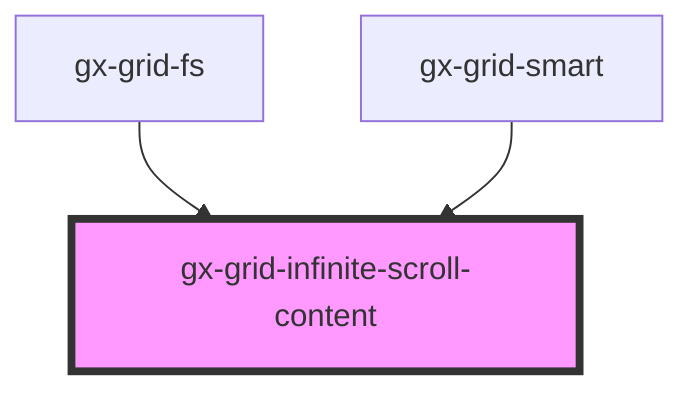

# gx-grid-infinite-scroll-content

This component is the default child used by the gx-infinite-scroll. It handles any markup inside.
This component will be shown automatically every time the Grid Infinite Scroll is loading.

<!-- Auto Generated Below -->

## Dependencies

### Used by

 - [gx-grid-fs](../grid-fs)
 - [gx-grid-smart](../grid-smart)

### Graph

----------------------------------------------

*Built with [StencilJS](https://stenciljs.com/)*
