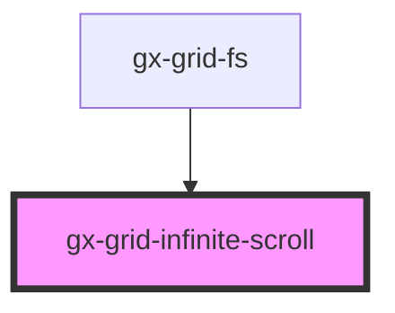

# gx-grid-infinite-scroll

The Infinite Scroll component calls an action to be performed when the user scrolls a specified distance from the bottom or top of the page.
The expression assigned to the gxInfinite event is called when the user reaches that defined distance. When this expression has finished any and all tasks, it should call the complete() method on the infinite scroll instance.

<!-- Auto Generated Below -->

## Properties

| Property                  | Attribute                   | Description                                                                                                                                                                                                                                                                                                                                                                                               | Type                | Default    |
| ------------------------- | --------------------------- | --------------------------------------------------------------------------------------------------------------------------------------------------------------------------------------------------------------------------------------------------------------------------------------------------------------------------------------------------------------------------------------------------------- | ------------------- | ---------- |
| `disabled`                | `disabled`                  | If `true`, the infinite scroll will be hidden and scroll event listeners will be removed. Set this to true to disable the infinite scroll from actively trying to receive new data while scrolling. This is useful when it is known that there is no more data that can be added, and the infinite scroll is no longer needed.                                                                            | `boolean`           | `false`    |
| `infiniteScrollContainer` | `infinite-scroll-container` | Query selector where the infinitie scroll would be listening to scroll events.                                                                                                                                                                                                                                                                                                                            | `string`            | `"div"`    |
| `itemCount`               | `item-count`                | This property must be bounded to grid item count property. It's unique purpose is to trigger gxInfinite as many times as needed to fullfill the Container space when the intial batch does not overflow the main container                                                                                                                                                                                | `number`            | `0`        |
| `position`                | `position`                  | The position of the infinite scroll element. The value can be either `top` or `bottom`.                                                                                                                                                                                                                                                                                                                   | `"bottom" \| "top"` | `"bottom"` |
| `threshold`               | `threshold`                 | The threshold distance from the bottom of the content to call the `infinite` output event when scrolled. The threshold value can be either a percent, or in pixels. For example, use the value of `10%` for the `infinite` output event to get called when the user has scrolled 10% from the bottom of the page. Use the value `100px` when the scroll is within 100 pixels from the bottom of the page. | `string`            | `"15%"`    |

## Events

| Event        | Description                                                                                                                                                                                 | Type                |
| ------------ | ------------------------------------------------------------------------------------------------------------------------------------------------------------------------------------------- | ------------------- |
| `gxInfinite` | Emitted when the scroll reaches the threshold distance. From within your infinite handler, you must call the infinite scroll's `complete()` method when your async operation has completed. | `CustomEvent<void>` |

## Methods

### `complete() => Promise<void>`

Call `complete()` within the `gxInfinite` output event handler when
your async operation has completed. For example, the `loading`
state is while the app is performing an asynchronous operation,
such as receiving more data from an AJAX request to add more items
to a data list. Once the data has been received and UI updated, you
then call this method to signify that the loading has completed.
This method will change the infinite scroll's state from `loading`
to `enabled`.

#### Returns

Type: `Promise<void>`

## Dependencies

### Used by

- [gx-grid-fs](../grid-fs)

### Graph

---

_Built with [StencilJS](https://stenciljs.com/)_
