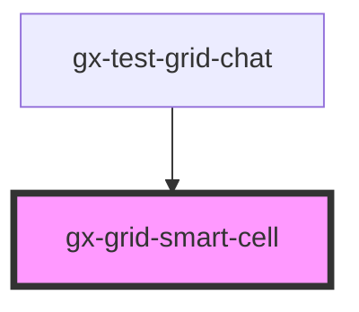

# gx-grid-smart-cell

<!-- Auto Generated Below -->

## Properties

| Property             | Attribute              | Description                                                                                                                                                                | Type      | Default     |
| -------------------- | ---------------------- | -------------------------------------------------------------------------------------------------------------------------------------------------------------------------- | --------- | ----------- |
| `cssClass`           | `css-class`            | The CSS class of gx-grid parent element.                                                                                                                                   | `string`  | `undefined` |
| `highlightable`      | `highlightable`        | True to highlight control when an action is fired.                                                                                                                         | `boolean` | `false`     |
| `index`              | `index`                | This attribute lets you specify the index of the cell. Useful when Inverse Loading is enabled on the grid.                                                                 | `number`  | `null`      |
| `isRowEven`          | `is-row-even`          | Whether this row is even position or not. This is specially required in Virtual scroll scenarios where the position in the DOM is not the real position in the collection. | `boolean` | `false`     |
| `itemsPerRow`        | `items-per-row`        | Number of Columns to be shown in the grid. Useful when Inverse Loading is enabled on the grid.                                                                             | `number`  | `null`      |
| `showHorizontalLine` | `show-horizontal-line` | True to show horizontal line.                                                                                                                                              | `boolean` | `false`     |

## Dependencies

### Used by

- [gx-test-grid-chat](../test/test-grid-chat)

### Graph

---

_Built with [StencilJS](https://stenciljs.com/)_
