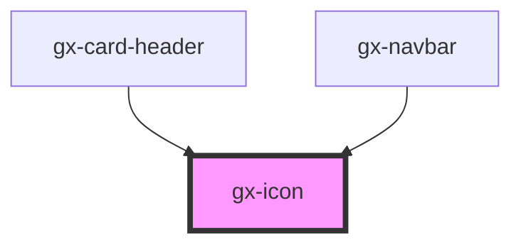

# gx-icon

## Using an icon

- Include the gx-icon component: `<gx-icon></gx-icon>`
- Set the `type` property to define the icon type.
- Set the `size` property (in pixels)
- Set the `color` property

<!-- Auto Generated Below -->

## Properties

| Property | Attribute | Description                                                                   | Type      | Default     |
| -------- | --------- | ----------------------------------------------------------------------------- | --------- | ----------- |
| `color`  | `color`   | The color of the icon.                                                        | `string`  | `undefined` |
| `lazy`   | `lazy`    | If enabled, the icon will be loaded lazily when it's visible in the viewport. | `boolean` | `false`     |
| `type`   | `type`    | The type of icon. Possible values: the name each of the icons in /assets.     | `string`  | `"none"`    |

## Dependencies

### Used by

- [gx-card-header](../card-header)
- [gx-navbar](../navbar)

### Graph

---

_Built with [StencilJS](https://stenciljs.com/)_
