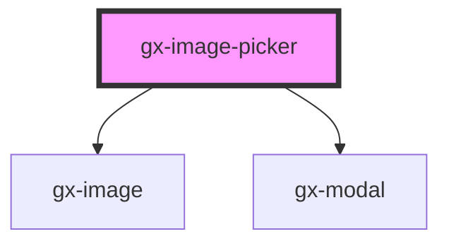

# gx-image-picker

<!-- Auto Generated Below -->

## Properties

| Property           | Attribute            | Description                                                                                                                                                                                                                                                                                                                                                                                                                                                                                 | Type                                                 | Default          |
| ------------------ | -------------------- | ------------------------------------------------------------------------------------------------------------------------------------------------------------------------------------------------------------------------------------------------------------------------------------------------------------------------------------------------------------------------------------------------------------------------------------------------------------------------------------------- | ---------------------------------------------------- | ---------------- |
| `alt`              | `alt`                | This attribute lets you specify the alternative text.                                                                                                                                                                                                                                                                                                                                                                                                                                       | `string`                                             | `""`             |
| `autoGrow`         | `auto-grow`          | If true, the component will be sized to match the image's intrinsic size when not constrained via CSS dimension properties (for example, height or width). If false, the component will never force its height to match the image's intrinsic size. The width, however, will match the intrinsic width. In GeneXus terms, it will auto grow horizontally, but not vertically.                                                                                                               | `boolean`                                            | `true`           |
| `cancelButtonText` | `cancel-button-text` | This attribute lets you specify the description of the cancel action button in the modal.                                                                                                                                                                                                                                                                                                                                                                                                   | `"CANCEL"`                                           | `"CANCEL"`       |
| `changeButtonText` | `change-button-text` | This attribute lets you specify the description of the change image button in the modal.                                                                                                                                                                                                                                                                                                                                                                                                    | `"Change image"`                                     | `"Change image"` |
| `cssClass`         | `css-class`          | A CSS class to set as the `gx-image-picker` element class.                                                                                                                                                                                                                                                                                                                                                                                                                                  | `string`                                             | `undefined`      |
| `disabled`         | `disabled`           | This attribute lets you specify if the element is disabled. If disabled, it will not fire any user interaction related event (for example, click event).                                                                                                                                                                                                                                                                                                                                    | `boolean`                                            | `false`          |
| `highlightable`    | `highlightable`      | True to highlight control when an action is fired.                                                                                                                                                                                                                                                                                                                                                                                                                                          | `boolean`                                            | `false`          |
| `invisibleMode`    | `invisible-mode`     | This attribute lets you specify how this element will behave when hidden. \| Value \| Details \| \| ------------ \| --------------------------------------------------------------------------- \| \| `keep-space` \| The element remains in the document flow, and it does occupy space. \| \| `collapse` \| The element is removed form the document flow, and it doesn't occupy space. \|                                                                                                | `"collapse" \| "keep-space"`                         | `"collapse"`     |
| `lazyLoad`         | `lazy-load`          | True to lazy load the image, when it enters the viewport.                                                                                                                                                                                                                                                                                                                                                                                                                                   | `boolean`                                            | `true`           |
| `modalTitle`       | `modal-title`        | This attribute lets you specify the modal title.                                                                                                                                                                                                                                                                                                                                                                                                                                            | `string`                                             | `null`           |
| `readonly`         | `readonly`           | This attribute lets you specify if the image is readonly. If readonly, it will not allow to use the edit button. In fact, the edit button will not be shown.                                                                                                                                                                                                                                                                                                                                | `boolean`                                            | `false`          |
| `removeButtonText` | `remove-button-text` | This attribute lets you specify the description of the remove image button in the modal.                                                                                                                                                                                                                                                                                                                                                                                                    | `"Remove image"`                                     | `"Remove image"` |
| `scaleType`        | `scale-type`         | This attribute allows specifing how the image is sized according to its container. `contain`, `cover`, `fill` and `none` map directly to the values of the CSS `object-fit` property. The `tile` value repeats the image, both vertically and horizontally, creating a tile effect.                                                                                                                                                                                                         | `"contain" \| "cover" \| "fill" \| "none" \| "tile"` | `undefined`      |
| `src`              | `src`                | This attribute lets you specify the `src` of the `img`.                                                                                                                                                                                                                                                                                                                                                                                                                                     | `string`                                             | `""`             |
| `srcset`           | `srcset`             | This attribute lets you specify the `srcset` of the `img`. The `srcset` attribute defines the set of images we will allow the browser to choose between, and what size each image is. Each set of image information is separated from the previous one by a comma.                                                                                                                                                                                                                          | `string`                                             | `""`             |
| `state`            | `state`              | This attribute lets you specify the current state of the gx-image-picker. \| Value \| Details \| \| ------------------- \| ----------------------------------------------------------------------------------------- \| \| `readyToUse` \| Allows you to choose, change or remove an image. \| \| `uploadingFile` \| It is set by the gx-image-picker control when the `reader` is loading the selected image. \| `uploadingFile` will not allow you to change or remove the current image. | `"readyToUse" \| "uploadingFile"`                    | `"readyToUse"`   |

## Events

| Event            | Description                     | Type                |
| ---------------- | ------------------------------- | ------------------- |
| `click`          | Fired when the image is clicked | `CustomEvent<any>`  |
| `onImageChanged` | Fired when the image is changed | `CustomEvent<File>` |

## CSS Custom Properties

| Name                                      | Description                                       |
| ----------------------------------------- | ------------------------------------------------- |
| `--gx-image-picker-icon-background-color` | Icon background color of the image picker button. |
| `--gx-image-picker-icon-color`            | Icon color of the image picker button.            |

## Dependencies

### Depends on

- [gx-image](../image)
- [gx-modal](../modal)

### Graph

---

_Built with [StencilJS](https://stenciljs.com/)_
