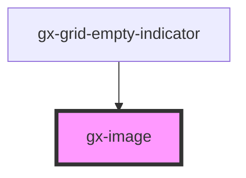

# gx-image

This component wraps an `` element, adding support for lazy loading.
A CSS animation with a spinning circle is used as a loading indicator while the image is being loaded.
The loading indicator can be disabled by setting the `--image-loading-indicator` CSS variable to `none`.

<!-- Auto Generated Below -->

## Properties

| Property           | Attribute            | Description                                                                                                                                                                                                                                                                                                                                                                                  | Type                                                 | Default      |
| ------------------ | -------------------- | -------------------------------------------------------------------------------------------------------------------------------------------------------------------------------------------------------------------------------------------------------------------------------------------------------------------------------------------------------------------------------------------- | ---------------------------------------------------- | ------------ |
| `alt`              | `alt`                | This attribute lets you specify the alternative text.                                                                                                                                                                                                                                                                                                                                        | `""`                                                 | `""`         |
| `autoGrow`         | `auto-grow`          | If true, the component will be sized to match the image's intrinsic size when not constrained via CSS dimension properties (for example, height or width). If false, the component will never force its height to match the image's intrinsic size. The width, however, will match the intrinsic width. In GeneXus terms, it will auto grow horizontally, but not vertically.                | `boolean`                                            | `true`       |
| `disabled`         | `disabled`           | This attribute lets you specify if the element is disabled. If disabled, it will not fire any user interaction related event (for example, click event).                                                                                                                                                                                                                                     | `boolean`                                            | `false`      |
| `height`           | `height`             | This attribute lets you specify the height.                                                                                                                                                                                                                                                                                                                                                  | `string`                                             | `undefined`  |
| `invisibleMode`    | `invisible-mode`     | This attribute lets you specify how this element will behave when hidden. \| Value \| Details \| \| ------------ \| --------------------------------------------------------------------------- \| \| `keep-space` \| The element remains in the document flow, and it does occupy space. \| \| `collapse` \| The element is removed form the document flow, and it doesn't occupy space. \| | `"collapse" \| "keep-space"`                         | `"collapse"` |
| `lazyLoad`         | `lazy-load`          | True to lazy load the image, when it enters the viewport.                                                                                                                                                                                                                                                                                                                                    | `boolean`                                            | `true`       |
| `lowResolutionSrc` | `low-resolution-src` | This attribute lets you specify the low resolution image SRC.                                                                                                                                                                                                                                                                                                                                | `""`                                                 | `""`         |
| `scaleType`        | `scale-type`         | This attribute allows specifing how the image is sized according to its container. `contain`, `cover`, `fill` and `none` map directly to the values of the CSS `object-fit` property. The `tile` value repeats the image, both vertically and horizontally, creating a tile effect.                                                                                                          | `"contain" \| "cover" \| "fill" \| "none" \| "tile"` | `undefined`  |
| `src`              | `src`                | This attribute lets you specify the SRC.                                                                                                                                                                                                                                                                                                                                                     | `""`                                                 | `""`         |
| `width`            | `width`              | This attribute lets you specify the width.                                                                                                                                                                                                                                                                                                                                                   | `string`                                             | `undefined`  |

## Dependencies

### Used by

- [gx-grid-empty-indicator](../grid-empty-indicator)

### Graph

---

_Built with [StencilJS](https://stenciljs.com/)_
