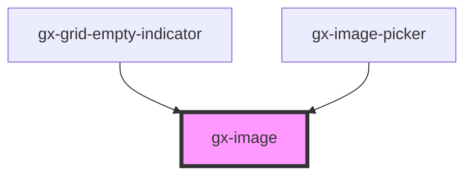

# gx-image

This component wraps an `` element, adding support for lazy loading.
A CSS animation with a spinning circle is used as a loading indicator while the image is being loaded.
The loading indicator can be disabled by setting the `--image-loading-indicator` CSS variable to `none`.

<!-- Auto Generated Below -->

## Properties

| Property                | Attribute                  | Description                                                                                                                                                                                                                                                                                                                                                                   | Type                                                 | Default     |
| ----------------------- | -------------------------- | ----------------------------------------------------------------------------------------------------------------------------------------------------------------------------------------------------------------------------------------------------------------------------------------------------------------------------------------------------------------------------- | ---------------------------------------------------- | ----------- |
| `alt`                   | `alt`                      | This attribute lets you specify the alternative text.                                                                                                                                                                                                                                                                                                                         | `string`                                             | `""`        |
| `autoGrow`              | `auto-grow`                | If true, the component will be sized to match the image's intrinsic size when not constrained via CSS dimension properties (for example, height or width). If false, the component will never force its height to match the image's intrinsic size. The width, however, will match the intrinsic width. In GeneXus terms, it will auto grow horizontally, but not vertically. | `boolean`                                            | `true`      |
| `cssClass`              | `css-class`                | A CSS class to set as the `gx-image` element class.                                                                                                                                                                                                                                                                                                                           | `string`                                             | `undefined` |
| `disabled`              | `disabled`                 | This attribute lets you specify if the element is disabled. If disabled, it will not fire any user interaction related event (for example, click event).                                                                                                                                                                                                                      | `boolean`                                            | `false`     |
| `highlightable`         | `highlightable`            | True to highlight control when an action is fired.                                                                                                                                                                                                                                                                                                                            | `boolean`                                            | `false`     |
| `lazyLoad`              | `lazy-load`                | True to lazy load the image, when it enters the viewport.                                                                                                                                                                                                                                                                                                                     | `boolean`                                            | `true`      |
| `scaleType`             | `scale-type`               | This attribute allows specifing how the image is sized according to its container. `contain`, `cover`, `fill` and `none` map directly to the values of the CSS `object-fit` property. The `tile` value repeats the image, both vertically and horizontally, creating a tile effect.                                                                                           | `"contain" \| "cover" \| "fill" \| "none" \| "tile"` | `undefined` |
| `showImagePickerButton` | `show-image-picker-button` | True to show the image picker button.                                                                                                                                                                                                                                                                                                                                         | `boolean`                                            | `false`     |
| `src`                   | `src`                      | This attribute lets you specify the `src` of the `img`.                                                                                                                                                                                                                                                                                                                       | `string`                                             | `""`        |
| `srcset`                | `srcset`                   | This attribute lets you specify the `srcset` of the `img`. The `srcset` attribute defines the set of images we will allow the browser to choose between, and what size each image is. Each set of image information is separated from the previous one by a comma.                                                                                                            | `string`                                             | `""`        |

## Dependencies

### Used by

- [gx-grid-empty-indicator](../grid-empty-indicator)
- [gx-image-picker](../image-picker)

### Graph

---

_Built with [StencilJS](https://stenciljs.com/)_
