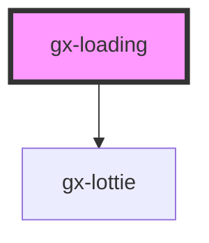

# gx-loading

An overlay that can be used to indicate activity while blocking user interaction. The loading indicator appears on top of the page content. It can be indeterminate, spinning
infinitely, or determinate, which allows the user to set its progress using the value property.

## Example

### Indeterminate loading

```html
<gx-loading
  caption="Loading"
  description="Please wait while we load some stuff"
  type="indeterminate"
  presented
>
</gx-loading>
```

### Determinate loading

```html
<gx-loading
  id="loading-1"
  caption="Loading"
  description="0%"
  type="determinate"
  presented
>
</gx-loading>
```

```js
const loadingEl = document.getElementById("loading-1")
loadingEl.value = 0.1;
await asyncOperation1();
loadingEl.value = 0.2;
await asyncOperation2();
...
...
loadingEl.value = 1;
```

<!-- Auto Generated Below -->

## Properties

| Property            | Attribute             | Description                                                                                                                                                                                         | Type      | Default     |
| ------------------- | --------------------- | --------------------------------------------------------------------------------------------------------------------------------------------------------------------------------------------------- | --------- | ----------- |
| `cssClass`          | `css-class`           | A CSS class to set as the `gx-loading` element class.                                                                                                                                               | `string`  | `undefined` |
| `didLoad`           | `did-load`            | `true` if the `componentDidLoad()` method was called. This property is not used as a state due to the following issue: https://github.com/ionic-team/stencil/issues/3158                            | `boolean` | `false`     |
| `lottiePath`        | `lottie-path`         | This attribute lets you specify the lottie path to use for the lottie animation. This property is not used as a state due to the following issue: https://github.com/ionic-team/stencil/issues/3158 | `string`  | `""`        |
| `presented`         | `presented`           | This attribute lets you specify if the loading is presented.                                                                                                                                        | `boolean` | `false`     |
| `showSlotAnimation` | `show-slot-animation` | `true` to display the animation defined in the default `<slot>` instead the native (default) animation.                                                                                             | `boolean` | `false`     |

## CSS Custom Properties

| Name                                | Description                                                                                           |
| ----------------------------------- | ----------------------------------------------------------------------------------------------------- |
| `--height`                          | Minimum height of the gx-loading when showing slot animations. (64px by default)                      |
| `--rotate-animation-circle-1-color` | Define the color of the first child of the rotate animation container. (rgb(71, 109, 255) by default) |
| `--rotate-animation-circle-2-color` | Define the color of the second child of the rotate animation container. (rgb(0, 0, 0) by default)     |
| `--rotate-animation-circle-3-color` | Define the color of the third child of the rotate animation container. (rgb(200, 10, 70) by default)  |
| `--rotate-animation-container-size` | Define the size of the rotate animation container. (48px by default)                                  |
| `--rotate-animation-duration`       | Define the duration of the rotate animation container. (1.5s by default)                              |

## Dependencies

### Depends on

- [gx-lottie](../lottie)

### Graph



---

_Built with [StencilJS](https://stenciljs.com/)_
