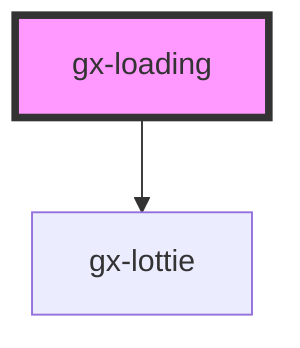

# gx-loading

An overlay that can be used to indicate activity while blocking user interaction. The loading indicator appears on top of the page content. It can be indeterminate, spinning
infinitely, or determinate, which allows the user to set its progress using the value property.

## Example

### Indeterminate loading

```html
<gx-loading
  caption="Loading"
  description="Please wait while we load some stuff"
  type="indeterminate"
  presented
>
</gx-loading>
```

### Determinate loading

```html
<gx-loading
  id="loading-1"
  caption="Loading"
  description="0%"
  type="determinate"
  presented
>
</gx-loading>
```

```js
const loadingEl = document.getElementById("loading-1")
loadingEl.value = 0.1;
await asyncOperation1();
loadingEl.value = 0.2;
await asyncOperation2();
...
...
loadingEl.value = 1;
```

<!-- Auto Generated Below -->

## Properties

| Property      | Attribute     | Description                                                                                                                                                                                                                                                                                                   | Type                               | Default     |
| ------------- | ------------- | ------------------------------------------------------------------------------------------------------------------------------------------------------------------------------------------------------------------------------------------------------------------------------------------------------------- | ---------------------------------- | ----------- |
| `caption`     | `caption`     | Sets the caption text.                                                                                                                                                                                                                                                                                        | `string`                           | `undefined` |
| `description` | `description` | Sets the description text.                                                                                                                                                                                                                                                                                    | `string`                           | `undefined` |
| `dialog`      | `dialog`      | Sets if the loading will be separated from the main content of the page. If `dialog = true` the `gx-loading` will be shown separated from the main content the web page in a dialog box. If `dialog = false` the `gx-loading` will be shown inside its container and will not be separated from the web page. | `boolean`                          | `false`     |
| `presented`   | `presented`   | Sets if the loading dialog is presented.                                                                                                                                                                                                                                                                      | `boolean`                          | `false`     |
| `type`        | `type`        | Sets the value.                                                                                                                                                                                                                                                                                               | `"determinate" \| "indeterminate"` | `undefined` |
| `value`       | `value`       | Sets the value when type is determinate. Must be a value between 0 and 1.                                                                                                                                                                                                                                     | `0`                                | `0`         |

## Dependencies

### Depends on

- [gx-lottie](../lottie)

### Graph



---

_Built with [StencilJS](https://stenciljs.com/)_
