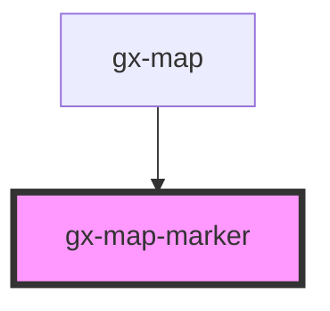

# gx-map-marker

This element represents a marker inside a `<gx-map>` element.
`coords` attribute must always have a value. If value is not specified, the marker will be initialized with default values and it will be drawn at `0, 0` coordinates.

## Usage Sample

```HTML
<gx-map-marker coords="-34.87845241095968, -56.07882142066956" tooltip-caption="Some title here"  icon-src="Url or path Icon" icon-src-name="IconName"></gx-map-marker>
```

> ### Sample with Popup Content

```HTML
    <gx-map-marker coords="-34.87845241095968, -56.07882142066956" tooltip-caption="Some title here">
        <div>
          <h3>
            Title of popUp here
          </h3>
          <p>Lorem ipsum dolor sit amet consectetur adipisicing elit.</p>
          <p>
            Sequi quasi sed error maxime repellat amet laborum ipsum vel labore
            qui, veritatis voluptas deleniti, inventore similique.
          </p>
          <p>Tempora molestias minus eveniet itaque!</p>
        </div>
    </gx-map-marker>
```

<!-- Auto Generated Below -->

## Properties

| Property         | Attribute         | Description                                                                                                            | Type                                                | Default     |
| ---------------- | ----------------- | ---------------------------------------------------------------------------------------------------------------------- | --------------------------------------------------- | ----------- |
| `alt`            | `alt`             | This attribute lets you specify the alternative text of the marker image.                                              | `string`                                            | `undefined` |
| `coords`         | `coords`          | The coordinates where the marker will appear in the map.                                                               | `string`                                            | `"0, 0"`    |
| `cssClass`       | `css-class`       | The class that the marker will have.                                                                                   | `string`                                            | `undefined` |
| `src`            | `src`             | This attribute lets you specify the src of the marker image.                                                           | `string`                                            | `undefined` |
| `srcset`         | `srcset`          | This attribute lets you specify the srcset of the marker image.                                                        | `string`                                            | `undefined` |
| `tooltipCaption` | `tooltip-caption` | The tooltip caption of the marker.                                                                                     | `string`                                            | `undefined` |
| `type`           | `type`            | This attribute lets you specify the marker type. Each marker type has different images and sizes depending on its use. | `"default" \| "selection-layer" \| "user-location"` | `"default"` |

## Events

| Event                | Description                                            | Type               |
| -------------------- | ------------------------------------------------------ | ------------------ |
| `gxMapMarkerDeleted` | Emitted when the element is deleted from a `<gx-map>`. | `CustomEvent<any>` |
| `gxMapMarkerDidLoad` | Emitted when the element is added to a `<gx-map>`.     | `CustomEvent<any>` |
| `gxMapMarkerUpdate`  | Emitted when the element update its data.              | `CustomEvent<any>` |

## Dependencies

### Used by

- [gx-map](../map)

### Graph



---

_Built with [StencilJS](https://stenciljs.com/)_
