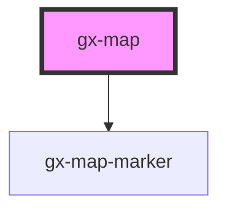

# gx-map

An element for showing an interactive map built using [LeafletJS](https://leafletjs.com/).
You can define the center, max zoom, and initial zoom of the map setting them as attributes of the component tag.
If you do not set any attribute, the map will initialize with default values.

The coordinate system used is the [EPSG:3857](https://epsg.io/) also known as "Web Mercator" _Latitude and Longitude coords separated by a comma_ (the same coordinate system used by Google and OpenStreetMap).

Syntax: `lat, lng`

Example: `-34.87945241095968, -56.078210142066956`

## Example

```HTML
    <gx-map center="-34.87945241095968, -56.078210142066956" zoom="12">
    </gx-map>
```

> ### Example with Marker

```HTML
    <gx-map center="-34.87945241095968, -56.078210142066956" zoom="12">
      <gx-map-marker coords="-34.87945241095968, -56.078210142066956" tooltip-caption="Some title here"></gx-map-marker>
    </gx-map>
```

<!-- Auto Generated Below -->

## Properties

| Property                       | Attribute                          | Description                                                                                                                                                                                                                                                                                                                                                                                                                                                                                                                                                                                                                                                                                                              | Type                                                         | Default      |
| ------------------------------ | ---------------------------------- | ------------------------------------------------------------------------------------------------------------------------------------------------------------------------------------------------------------------------------------------------------------------------------------------------------------------------------------------------------------------------------------------------------------------------------------------------------------------------------------------------------------------------------------------------------------------------------------------------------------------------------------------------------------------------------------------------------------------------ | ------------------------------------------------------------ | ------------ |
| `center`                       | `center`                           | The coord of initial center of the map.                                                                                                                                                                                                                                                                                                                                                                                                                                                                                                                                                                                                                                                                                  | `string`                                                     | `"0,0"`      |
| `clusteringPoints`             | `clustering-points`                | This attribute determines whether map markers should be grouped. When true, the markers will be grouped depending on their proximity                                                                                                                                                                                                                                                                                                                                                                                                                                                                                                                                                                                     | `boolean`                                                    | `true`       |
| `directionLayer`               | `direction-layer`                  | Enables the possibility to draw the route between two points on the map.                                                                                                                                                                                                                                                                                                                                                                                                                                                                                                                                                                                                                                                 | `boolean`                                                    | `false`      |
| `directionLayerWKTString`      | `direction-layer-w-k-t-string`     | WKT format string containing the response of Google Maps Directions API call                                                                                                                                                                                                                                                                                                                                                                                                                                                                                                                                                                                                                                             | `string`                                                     | `undefined`  |
| `highAccuracyLocator`          | `high-accuracy-locator`            | Enable the High Accuracy in user location. _Note: This property applies when `watchPosition = true`._                                                                                                                                                                                                                                                                                                                                                                                                                                                                                                                                                                                                                    | `boolean`                                                    | `true`       |
| `initialZoom`                  | `initial-zoom`                     | Indicates how the map will be displayed at startup \| Value \| Details \| \| ------------ \| --------------------------------------------------------------------------- \| \| `showAll` \| (Default value) the map is adjusted to display all the loaded points (and the current device location if Show My Location is set to True). \| \| `nearestPoint` \| The map is adjusted to display the current device location and shows my location and the nearest point. \| \| `radius` \| The map is adjusted to display a fixed radius, from the specified center. The radius value is specified using the initialZoomRadius property \| \| `noInitialZoom` \| No specific action is taken regarding the initial zoom \| | `"nearestPoint" \| "noInitialZoom" \| "radius" \| "showAll"` | `"showAll"`  |
| `initialZoomRadius`            | `initial-zoom-radius`              | The radius value if initialZoom is set to "radius"                                                                                                                                                                                                                                                                                                                                                                                                                                                                                                                                                                                                                                                                       | `number`                                                     | `1`          |
| `mapProvider`                  | `map-provider`                     | The map provider. _Note: Currently, this property is for setting a custom map provider using an URL._                                                                                                                                                                                                                                                                                                                                                                                                                                                                                                                                                                                                                    | `string`                                                     | `undefined`  |
| `mapType`                      | `map-type`                         | Map type to be used. _Note: If you set a map provider, the selected map type will be ignored._ \| Value \| Details \| \| ------------ \| --------------------------------------------------------------------------- \| \| `standard` \| Shows streets. \| \| `satellite` \| Shows satellite images of the Earth. \| \| `hybrid` \| Shows streets over the satellite images. \|                                                                                                                                                                                                                                                                                                                                          | `"hybrid" \| "satellite" \| "standard"`                      | `"standard"` |
| `pinImageCssClass`             | `pin-image-css-class`              | A CSS class to set as the `showMyLocation` icon class.                                                                                                                                                                                                                                                                                                                                                                                                                                                                                                                                                                                                                                                                   | `string`                                                     | `undefined`  |
| `pinImageSrcset`               | `pin-image-srcset`                 | This attribute lets you specify the srcset attribute for the `showMyLocation` icon when the `pinShowMyLocationSrcset` property is not specified.                                                                                                                                                                                                                                                                                                                                                                                                                                                                                                                                                                         | `string`                                                     | `undefined`  |
| `pinShowMyLocationSrcset`      | `pin-show-my-location-srcset`      | This attribute lets you specify the srcset attribute for the `showMyLocation` icon. If not set the `pinImageSrcset` property will be used to specify the srcset attribute for the icon. If none of the properties are specified, a default icon will be used when `showMyLocation = true`                                                                                                                                                                                                                                                                                                                                                                                                                                | `string`                                                     | `undefined`  |
| `scrollWheelZoom`              | `scroll-wheel-zoom`                | Whether the map can be zoomed by using the mouse wheel.                                                                                                                                                                                                                                                                                                                                                                                                                                                                                                                                                                                                                                                                  | `boolean`                                                    | `true`       |
| `selectionLayer`               | `selection-layer`                  | Enables the possibility to navigate the map and select a location point using the map center.                                                                                                                                                                                                                                                                                                                                                                                                                                                                                                                                                                                                                            | `boolean`                                                    | `false`      |
| `selectionTargetImageCssClass` | `selection-target-image-css-class` | A CSS class to set as the `selectionLayer` icon class.                                                                                                                                                                                                                                                                                                                                                                                                                                                                                                                                                                                                                                                                   | `string`                                                     | `undefined`  |
| `selectionTargetImageSrcset`   | `selection-target-image-srcset`    | This attribute lets you specify the srcset attribute for the `selectionLayer` icon. If not set the `pinImageSrcset` property will be used to specify the srcset attribute for the icon. If none of the properties are specified, a default icon will be used when `selectionLayer = true`                                                                                                                                                                                                                                                                                                                                                                                                                                | `string`                                                     | `undefined`  |
| `showMyLocation`               | `show-my-location`                 | Indicates if the current location of the device is displayed on the map.                                                                                                                                                                                                                                                                                                                                                                                                                                                                                                                                                                                                                                                 | `boolean`                                                    | `false`      |
| `zoom`                         | `zoom`                             | The initial zoom level in the map.                                                                                                                                                                                                                                                                                                                                                                                                                                                                                                                                                                                                                                                                                       | `number`                                                     | `1`          |

## Events

| Event                | Description                                                                | Type               |
| -------------------- | -------------------------------------------------------------------------- | ------------------ |
| `gxMapDidLoad`       | Emmited when the map is loaded.                                            | `CustomEvent<any>` |
| `mapClick`           | Emmited when the map is clicked and return click coords.                   | `CustomEvent<any>` |
| `selectionChange`    | Emmited when the map stops from being moved, if selection layer is active. | `CustomEvent<any>` |
| `selectionInput`     | Emmited when the map is being moved, if selection layer is active.         | `CustomEvent<any>` |
| `userLocationChange` | Emmited when the user location coords change.                              | `CustomEvent<any>` |

## CSS Custom Properties

| Name                | Description                                                     |
| ------------------- | --------------------------------------------------------------- |
| `--gx-fill-color`   | The fill color to use for the path. (white by default)          |
| `--gx-stroke-color` | The stroke color to use for the path. (currentColor by default) |
| `--gx-stroke-width` | Yhe stroke width to use for the path. (2.5 by default)          |

## Dependencies

### Depends on

- [gx-map-marker](../map-marker)

### Graph



---

_Built with [StencilJS](https://stenciljs.com/)_
