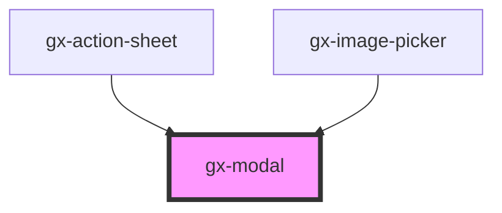

# gx-modal

A content container for showing modal dialogs with actions for lightboxes, notifications, confirmation, etc.
The dialog appears on top of the page content.

## Children

The different building blocks of the modal dialog can be specified using a set of
predefined slots:

| Slot               | Details                                                                                                          |
| ------------------ | ---------------------------------------------------------------------------------------------------------------- |
| `header`           | This slot will be rendered as the header of the modal dialog                                                     |
| `body`             | This slot will be rendered as the body of the modal dialog                                                       |
| `primary-action`   | This slot will be rendered as a primary action of the modal dialog (for example, a "Confirm" button).            |
| `secondary-action` | This slot will be rendered as a secondary action of the modal dialog (for example, a "Close" or "Cancel" button) |

## Example

```html
<gx-modal auto-close="true" opened="true">
  <span slot="header"> Sample modal dialog </span>
  <gx-button slot="primary-action">Confirm</gx-button>
  <gx-button slot="secondary-action">Cancel</gx-button>
  <div slot="body">This is the modal dialog's content</div>
</gx-modal>
```

<!-- Auto Generated Below -->

## Properties

| Property           | Attribute            | Description                                                                                                                           | Type                             | Default     |
| ------------------ | -------------------- | ------------------------------------------------------------------------------------------------------------------------------------- | -------------------------------- | ----------- |
| `autoClose`        | `auto-close`         | This attribute lets you specify if the modal dialog is automatically closed when an action is clicked.                                | `boolean`                        | `undefined` |
| `closeButtonLabel` | `close-button-label` | This attribute lets you specify the label for the close button. Important for accessibility.                                          | `string`                         | `undefined` |
| `height`           | `height`             | This attribute lets you specify the height of the control.                                                                            | `string`                         | `null`      |
| `opened`           | `opened`             | This attribute lets you specify if the modal dialog is opened or closed.                                                              | `boolean`                        | `false`     |
| `showBody`         | `show-body`          | This attribute lets you specify if a body is rendered in the middle of the modal dialog.                                              | `boolean`                        | `true`      |
| `showFooter`       | `show-footer`        | This attribute lets you specify if a footer is rendered at the bottom of the modal dialog.                                            | `boolean`                        | `true`      |
| `showHeader`       | `show-header`        | This attribute lets you specify if a header is rendered on top of the modal dialog.                                                   | `boolean`                        | `true`      |
| `type`             | `type`               | If `type != "popup"`, the modal dialog will render with more advanced styling, including `box-shadow`, `border-radius` and `padding`. | `"alert" \| "dialog" \| "popup"` | `"dialog"`  |
| `width`            | `width`              | This attribute lets you specify the width of the control.                                                                             | `string`                         | `null`      |

## Events

| Event   | Description                           | Type               |
| ------- | ------------------------------------- | ------------------ |
| `close` | Fired when the modal dialog is closed | `CustomEvent<any>` |
| `open`  | Fired when the modal dialog is opened | `CustomEvent<any>` |

## Shadow Parts

| Part             | Description |
| ---------------- | ----------- |
| `"body"`         |             |
| `"close-button"` |             |
| `"dialog"`       |             |
| `"footer"`       |             |
| `"header"`       |             |

## CSS Custom Properties

| Name                                  | Description                          |
| ------------------------------------- | ------------------------------------ |
| `--gx-modal-accent-color`             | Accent color for gx-modal's actions. |
| `--gx-modal-content-background-color` | Background color for body and footer |
| `--gx-modal-mask-background-color`    | Mask background color                |

## Dependencies

### Used by

- [gx-action-sheet](../action-sheet)
- [gx-image-picker](../image-picker)

### Graph



---

_Built with [StencilJS](https://stenciljs.com/)_
