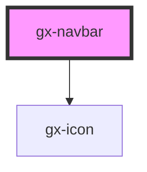

# gx-navbar

A navigation bar for showing a logo, a header text, a list of navigation links for navigation purposes and a list of actions.

It can be rendered in a single line or two lines, using the `singleLine` property. If `singleLine` is true, the logo, header text and navigation links are rendered in the first line, and the actions and an optional "Back" button are rendered in the second line.

## Children

### Logo or brand image

A logo or brand image can be specified using an `` element with `slot="header"` attribute set.

### Items

Currently the navigation bar support specifying a set of items using `<gx-navbar-item>` elements.
The child items can be rendered in different parts of the navigation bar.
If no slot is specified, the items are rendered in the middle of the navigation bar, as navigation links. These items are rendered at the bottom of the page in extra small screens.
It also supports a set of items that will be rendered according to their priority:

| Priority | Slot name              | Location                                                                                 |
| -------- | ---------------------- | ---------------------------------------------------------------------------------------- |
| High     | high-priority-action   | Right of the navigation bar                                                              |
| Normal   | normal-priority-action | Right of the navigation bar, after high priority items                                   |
| Low      | low-priority-action    | Inside a drop down displayed when a trigger button shown after the normal priority items |

## Example

```html
<gx-navbar caption="Sample">
  <gx-navbar-item slot="navigation" href="#"
    >First navigation item</gx-navbar-item
  >
  <gx-navbar-item slot="navigation" href="#" active=""
    >Second navigation item (active)</gx-navbar-item
  >
  <gx-navbar-item slot="navigation" href="#"
    >Third navigation item</gx-navbar-item
  >
  <gx-navbar-item slot="high-priority-action">High priority</gx-navbar-item>
  <gx-navbar-item slot="normal-priority-action">Normal priority</gx-navbar-item>
  <gx-navbar-item slot="low-priority-action">Low priority</gx-navbar-item>
</gx-navbar>
```

<!-- Auto Generated Below -->

## Properties

| Property                  | Attribute                    | Description                                                                                                                                                                                                                                                                                                  | Type                | Default     |
| ------------------------- | ---------------------------- | ------------------------------------------------------------------------------------------------------------------------------------------------------------------------------------------------------------------------------------------------------------------------------------------------------------ | ------------------- | ----------- |
| `actionToggleButtonLabel` | `action-toggle-button-label` | This attribute lets you specify the label for the low priority actions toggle button. Important for accessibility.                                                                                                                                                                                           | `string`            | `undefined` |
| `backButtonLabel`         | `back-button-label`          | This attribute lets you specify the label for the back button.                                                                                                                                                                                                                                               | `string`            | `undefined` |
| `caption`                 | `caption`                    | This attribute lets you specify an optional title for the navigation bar                                                                                                                                                                                                                                     | `string`            | `undefined` |
| `cssClass`                | `css-class`                  | A CSS class to set as the `gx-navbar` element class.                                                                                                                                                                                                                                                         | `string`            | `undefined` |
| `position`                | `position`                   | This attribute lets you specify the position of the navbar in the viewport. If `position = "top"` the navbar will be placed normally at the top of the viewport. If `position = "bottom"` the navbar will be placed at the bottom of the viewport. This position of navbar is used to show navigation links. | `"bottom" \| "top"` | `"top"`     |
| `showBackButton`          | `show-back-button`           | True to show the back button                                                                                                                                                                                                                                                                                 | `boolean`           | `undefined` |
| `showToggleButton`        | `show-toggle-button`         | True to show the left target toggle button (a burger icon)                                                                                                                                                                                                                                                   | `boolean`           | `undefined` |
| `singleLine`              | `single-line`                | This attribute lets you specify if one or two lines will be used to render the navigation bar. Useful when there are links and also actions, to have links in the first line, and actions in the second                                                                                                      | `boolean`           | `true`      |
| `toggleButtonLabel`       | `toggle-button-label`        | This attribute lets you specify the label for the left target toggle button. Important for accessibility.                                                                                                                                                                                                    | `string`            | `undefined` |

## Events

| Event               | Description                             | Type               |
| ------------------- | --------------------------------------- | ------------------ |
| `backButtonClick`   | Fired when the back button is clicked   | `CustomEvent<any>` |
| `toggleButtonClick` | Fired when the toggle button is clicked | `CustomEvent<any>` |

## Shadow Parts

| Part                 | Description |
| -------------------- | ----------- |
| `"action-low"`       |             |
| `"action-low-popup"` |             |
| `"back-button"`      |             |
| `"default-button"`   |             |

## Dependencies

### Depends on

- [gx-icon](../icon)

### Graph



---

_Built with [StencilJS](https://stenciljs.com/)_
