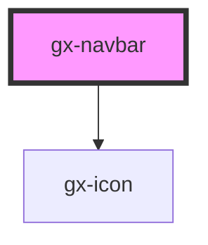

# gx-navbar

A navigation bar for showing a logo, a text and a list of links for navigation purposes.

## Children

### Logo or brand image

A logo or brand image can be specified using an `` element with `slot="header"` attribute set.

### Items

Currently the navigation bar support specifying a set of links using `<gx-navbar-link>` elements.

## Example

```html
<gx-navbar caption="Sample">
  <gx-navbar-link href="#">First item</gx-navbar-link>
  <gx-navbar-link href="#" active="">Second item (active)</gx-navbar-link>
  <gx-navbar-link href="#" disabled="">Third item (disabled)</gx-navbar-link>
</gx-navbar>
```

<!-- Auto Generated Below -->

## Properties

| Property                  | Attribute                    | Description                                                                                                                                                                                                                                                                                                                                                                                 | Type      | Default     |
| ------------------------- | ---------------------------- | ------------------------------------------------------------------------------------------------------------------------------------------------------------------------------------------------------------------------------------------------------------------------------------------------------------------------------------------------------------------------------------------- | --------- | ----------- |
| `actionToggleButtonLabel` | `action-toggle-button-label` | This attribute lets you specify the label for the low priority actions toggle button. Important for accessibility.                                                                                                                                                                                                                                                                          | `string`  | `undefined` |
| `backButtonLabel`         | `back-button-label`          | This attribute lets you specify the label for the back button.                                                                                                                                                                                                                                                                                                                              | `string`  | `undefined` |
| `caption`                 | `caption`                    | This attribute lets you specify an optional title for the navigation bar \| Value \| Details \| \| ------------ \| --------------------------------------------------------------------------- \| \| `keep-space` \| The element remains in the document flow, and it does occupy space. \| \| `collapse` \| The element is removed form the document flow, and it doesn't occupy space. \| | `string`  | `undefined` |
| `showBackButton`          | `show-back-button`           | True to show the back button                                                                                                                                                                                                                                                                                                                                                                | `boolean` | `undefined` |
| `showToggleButton`        | `show-toggle-button`         | True to show the left target toggle button (a burger icon)                                                                                                                                                                                                                                                                                                                                  | `boolean` | `undefined` |
| `singleLine`              | `single-line`                | This attribute lets you specify if one or two lines will be used to render the navigation bar. Useful when there are links and also actions, to have links in the first line, and actions in the second                                                                                                                                                                                     | `boolean` | `true`      |
| `toggleButtonLabel`       | `toggle-button-label`        | This attribute lets you specify the label for the left target toggle button. Important for accessibility.                                                                                                                                                                                                                                                                                   | `string`  | `undefined` |

## Events

| Event               | Description                             | Type               |
| ------------------- | --------------------------------------- | ------------------ |
| `toggleButtonClick` | Fired when the toggle button is clicked | `CustomEvent<any>` |

## Dependencies

### Depends on

- [gx-icon](../icon)

### Graph



---

_Built with [StencilJS](https://stenciljs.com/)_
