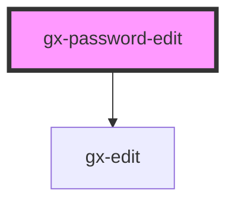

# gx-password-edit

An password edit box with that optionally shows a button to reveal the password value.

<!-- Auto Generated Below -->

## Properties

| Property              | Attribute                | Description                                                                                                                                                                                                                   | Type                                                                                  | Default     |
| --------------------- | ------------------------ | ----------------------------------------------------------------------------------------------------------------------------------------------------------------------------------------------------------------------------- | ------------------------------------------------------------------------------------- | ----------- |
| `accessibleName`      | `accessible-name`        | Specifies a short string, typically 1 to 3 words, that authors associate with an element to provide users of assistive technologies with a label for the element. Only works if `readonly="false"`.                           | `string`                                                                              | `undefined` |
| `cssClass`            | `css-class`              | A CSS class to set as the `gx-password-edit` element class.                                                                                                                                                                   | `string`                                                                              | `undefined` |
| `disabled`            | `disabled`               | This attribute lets you specify if the element is disabled. If disabled, it will not fire any user interaction related event (for example, click event).                                                                      | `boolean`                                                                             | `false`     |
| `maxLength`           | `max-length`             | This property defines the maximum string length that the user can enter into the control. Only works when `readonly === false`.                                                                                               | `number`                                                                              | `undefined` |
| `mode`                | `mode`                   | This attribute hints at the type of data that might be entered by the user while editing the element or its contents. This allows a browser to display an appropriate virtual keyboard. Only works when `readonly === false`. | `"decimal" \| "email" \| "none" \| "numeric" \| "search" \| "tel" \| "text" \| "url"` | `undefined` |
| `pattern`             | `pattern`                | This attribute specifies a regular expression the form control's value should match. Only works when `readonly === false`.                                                                                                    | `string`                                                                              | `undefined` |
| `placeholder`         | `placeholder`            | A hint to the user of what can be entered in the control. Same as [placeholder](https://developer.mozilla.org/en-US/docs/Web/HTML/Element/input#attr-placeholder) attribute for `input` elements.                             | `string`                                                                              | `undefined` |
| `readonly`            | `readonly`               | This attribute indicates that the user cannot modify the value of the control. Same as [readonly](https://developer.mozilla.org/en-US/docs/Web/HTML/Element/input#attr-readonly) attribute for `input` elements.              | `boolean`                                                                             | `undefined` |
| `revealButtonTextOff` | `reveal-button-text-off` | Text of the reveal button to offer hiding the password.                                                                                                                                                                       | `string`                                                                              | `undefined` |
| `revealButtonTextOn`  | `reveal-button-text-on`  | Text of the reveal button to offer revealing the password.                                                                                                                                                                    | `string`                                                                              | `undefined` |
| `showRevealButton`    | `show-reveal-button`     | If true, a reveal password button is shown next to the password input. Pressing the reveal button toggles the password mask, allowing the user to view the password text.                                                     | `boolean`                                                                             | `undefined` |
| `value`               | `value`                  | The initial value of the control.                                                                                                                                                                                             | `string`                                                                              | `undefined` |

## Events

| Event    | Description                                                                                                                                                                                                                                | Type               |
| -------- | ------------------------------------------------------------------------------------------------------------------------------------------------------------------------------------------------------------------------------------------ | ------------------ |
| `change` | The `change` event is emitted when a change to the element's value is committed by the user. Unlike the `input` event, the `change` event is not necessarily fired for each change to an element's value but when the control loses focus. | `CustomEvent<any>` |
| `input`  | The `input` event is fired synchronously when the value is changed.                                                                                                                                                                        | `CustomEvent<any>` |

## Methods

### `getNativeInputId() => Promise<string>`

Returns the id of the inner `input` element (if set).

#### Returns

Type: `Promise<string>`

## Dependencies

### Depends on

- [gx-edit](../edit)

### Graph

---

_Built with [StencilJS](https://stenciljs.com/)_
