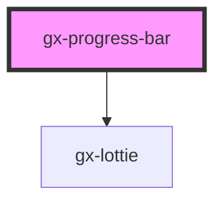

# gx-progress-bar

An element for showing a progress bar.

## Children

The text caption of the progress bar will be its text content. Being a child instead of an attribute allows us to set text or HTML.

<!-- Auto Generated Below -->

## Properties

| Property      | Attribute     | Description                                                                                                                                                                             | Type                               | Default           |
| ------------- | ------------- | --------------------------------------------------------------------------------------------------------------------------------------------------------------------------------------- | ---------------------------------- | ----------------- |
| `caption`     | `caption`     | It specifies the main text that is shown on the dialog.                                                                                                                                 | `string`                           | `null`            |
| `cssClass`    | `css-class`   | A CSS class to set as the `gx-progress-bar` element class.                                                                                                                              | `string`                           | `undefined`       |
| `description` | `description` | It specifies more information that is shown on the dialog.                                                                                                                              | `string`                           | `null`            |
| `maxValue`    | `max-value`   | This attribute lets you specify maximum value when type is `"determinate"`.                                                                                                             | `number`                           | `100`             |
| `presented`   | `presented`   | This attribute lets you specify if the progress dialog is presented.                                                                                                                    | `boolean`                          | `false`           |
| `type`        | `type`        | It specifies the type of progress indicator. Determinate indicators show the progress of the processing, while indeterminate ones don't inform you about the status during the process. | `"determinate" \| "indeterminate"` | `"indeterminate"` |
| `value`       | `value`       | This attribute lets you specify the value when type is `"determinate"`.                                                                                                                 | `number`                           | `0`               |

## CSS Custom Properties

| Name                                        | Description                                                                                                                                                                 |
| ------------------------------------------- | --------------------------------------------------------------------------------------------------------------------------------------------------------------------------- |
| `--gx-progress-bar-accent-color`            | Background color used on `type = "indeterminate"` to style the circle. Also, this color is used to highlight the progress bar loading animation when `type = "determinate"` |
| `--gx-progress-bar-dialog-background-color` | Dialog background color                                                                                                                                                     |
| `--gx-progress-bar-mask-background-color`   | Mask background color                                                                                                                                                       |
| `--gx-progress-bar-primary-color`           | Background color used on `type = "determinate"` to style the first half of the progress bar                                                                                 |

## Dependencies

### Depends on

- [gx-lottie](../lottie)

### Graph

---

_Built with [StencilJS](https://stenciljs.com/)_
