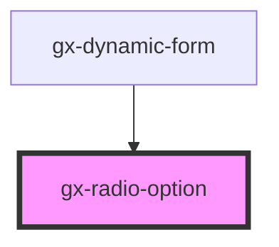

# gx-radio-option

Radios are generally used as a set of related options inside of a group, but they can also be used alone. Pressing on a radio will check it. They can also be checked programmatically by setting the checked property.

An `gx-radio-group` can be used to group a set of radios. When radios are inside of a [radio group](../radio-group/readme.md), only one radio in the group will be checked at any time. Pressing a radio will check it and uncheck the previously selected radio, if there is one. If a radio is not in a group with another radio, then both radios will have the ability to be checked at the same time.

<!-- Auto Generated Below -->

## Properties

| Property        | Attribute        | Description                                                                                                                                                                                                                                                                                                                                                                                  | Type                         | Default      |
| --------------- | ---------------- | -------------------------------------------------------------------------------------------------------------------------------------------------------------------------------------------------------------------------------------------------------------------------------------------------------------------------------------------------------------------------------------------- | ---------------------------- | ------------ |
| `caption`       | `caption`        | Specifies the label of the radio.                                                                                                                                                                                                                                                                                                                                                            | `string`                     | `undefined`  |
| `checked`       | `checked`        | Indicates that the control is selected by default.                                                                                                                                                                                                                                                                                                                                           | `boolean`                    | `undefined`  |
| `disabled`      | `disabled`       | This attribute lets you specify if the element is disabled. If disabled, it will not fire any user interaction related event (for example, click event).                                                                                                                                                                                                                                     | `boolean`                    | `false`      |
| `invisibleMode` | `invisible-mode` | This attribute lets you specify how this element will behave when hidden. \| Value \| Details \| \| ------------ \| --------------------------------------------------------------------------- \| \| `keep-space` \| The element remains in the document flow, and it does occupy space. \| \| `collapse` \| The element is removed form the document flow, and it doesn't occupy space. \| | `"collapse" \| "keep-space"` | `"collapse"` |
| `name`          | `name`           | The name of the inner input of type radio                                                                                                                                                                                                                                                                                                                                                    | `string`                     | `undefined`  |
| `value`         | `value`          | The initial value of the control.                                                                                                                                                                                                                                                                                                                                                            | `string`                     | `undefined`  |

## Events

| Event              | Description                                                                                  | Type               |
| ------------------ | -------------------------------------------------------------------------------------------- | ------------------ |
| `change`           | The `change` event is emitted when a change to the element's value is committed by the user. | `CustomEvent<any>` |
| `gxRadioDidLoad`   | Emitted when the radio loads.                                                                | `CustomEvent<any>` |
| `gxRadioDidUnload` | Emitted when the radio unloads.                                                              | `CustomEvent<any>` |
| `gxSelect`         | Emitted when the radio button is selected.                                                   | `CustomEvent<any>` |

## Dependencies

### Used by

- [gx-dynamic-form](../dynamic-form)

### Graph

---

_Built with [StencilJS](https://stenciljs.com/)_
