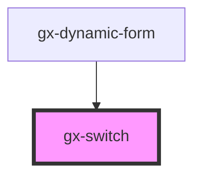

# gx-switch

A switch/toggle control that enables you to select between options.

<!-- Auto Generated Below -->

## Properties

| Property           | Attribute            | Description                                                                                                                                                                                                                                                                                                                                                                                  | Type                         | Default      |
| ------------------ | -------------------- | -------------------------------------------------------------------------------------------------------------------------------------------------------------------------------------------------------------------------------------------------------------------------------------------------------------------------------------------------------------------------------------------- | ---------------------------- | ------------ |
| `accessibleName`   | `accessible-name`    | Specifies a short string, typically 1 to 3 words, that authors associate with an element to provide users of assistive technologies with a label for the element.                                                                                                                                                                                                                            | `string`                     | `undefined`  |
| `checkedCaption`   | `checked-caption`    | Caption displayed when the switch is 'on'                                                                                                                                                                                                                                                                                                                                                    | `string`                     | `undefined`  |
| `checkedValue`     | `checked-value`      | The value when the switch is 'on'                                                                                                                                                                                                                                                                                                                                                            | `string`                     | `undefined`  |
| `cssClass`         | `css-class`          | A CSS class to set as the `gx-switch` element class.                                                                                                                                                                                                                                                                                                                                         | `string`                     | `undefined`  |
| `disabled`         | `disabled`           | This attribute allows you specify if the element is disabled. If disabled, it will not trigger any user interaction related event (for example, click event).                                                                                                                                                                                                                                | `boolean`                    | `false`      |
| `invisibleMode`    | `invisible-mode`     | This attribute lets you specify how this element will behave when hidden. \| Value \| Details \| \| ------------ \| --------------------------------------------------------------------------- \| \| `keep-space` \| The element remains in the document flow, and it does occupy space. \| \| `collapse` \| The element is removed form the document flow, and it doesn't occupy space. \| | `"collapse" \| "keep-space"` | `"collapse"` |
| `unCheckedCaption` | `un-checked-caption` | Caption displayed when the switch is 'off'                                                                                                                                                                                                                                                                                                                                                   | `string`                     | `undefined`  |
| `unCheckedValue`   | `un-checked-value`   | The value when the switch is 'off'                                                                                                                                                                                                                                                                                                                                                           | `string`                     | `undefined`  |
| `value`            | `value`              | The value of the control.                                                                                                                                                                                                                                                                                                                                                                    | `string`                     | `null`       |

## Events

| Event   | Description                                                                                 | Type               |
| ------- | ------------------------------------------------------------------------------------------- | ------------------ |
| `input` | The 'input' event is emitted when a change to the element's value is committed by the user. | `CustomEvent<any>` |

## Methods

### `getNativeInputId() => Promise<string>`

Returns the id of the inner `input` element (if set).

#### Returns

Type: `Promise<string>`

## Dependencies

### Used by

- [gx-dynamic-form](../dynamic-form)

### Graph

---

_Built with [StencilJS](https://stenciljs.com/)_
