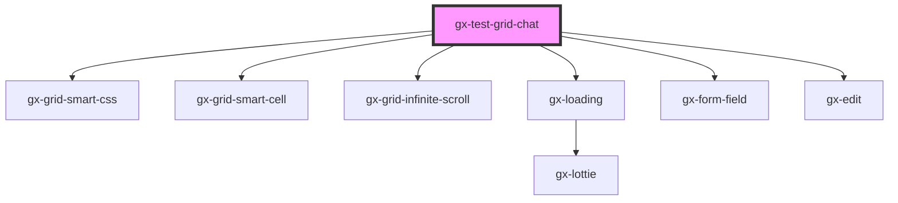

# gx-test-grid-chat

<!-- Auto Generated Below -->

## Properties

| Property | Attribute | Description                                      | Type                    | Default |
| -------- | --------- | ------------------------------------------------ | ----------------------- | ------- |
| `record` | --        | Specifies the record that the chat will display. | `TestGridChatMessage[]` | `[]`    |

## Dependencies

### Depends on

- [gx-grid-smart-css](../../grid-smart-css)
- [gx-grid-smart-cell](../../grid-smart-cell)
- [gx-grid-infinite-scroll](../../grid-infinite-scroll)
- [gx-loading](../../loading)
- [gx-form-field](../../form-field)
- [gx-edit](../../edit)

### Graph

---

_Built with [StencilJS](https://stenciljs.com/)_
