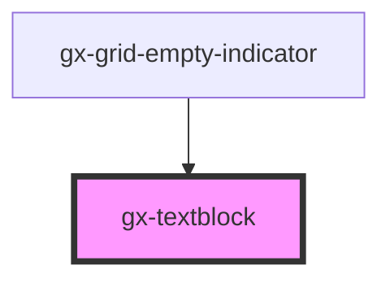

# gx-textblock

This is a simple element that allows showing text. Optionally, a URL can be specified in the `href` attribute, to behave as an anchor.

## Children

The text caption of the textblock will be its text content. Being a child instead of an attribute allows us to set text or HTML.

## Styling with SASS

A SASS mixin called `gx-textblock` is provided in `theming/theming-mixins.scss` to ease the styling of this element. See the theming [mixins documentation](/sassdoc/theming-mixins.html.md) for more information.

<!-- Auto Generated Below -->

## Properties

| Property        | Attribute       | Description                                                                                                                                                                                                                                                                                                           | Type               | Default     |
| --------------- | --------------- | --------------------------------------------------------------------------------------------------------------------------------------------------------------------------------------------------------------------------------------------------------------------------------------------------------------------- | ------------------ | ----------- |
| `cssClass`      | `css-class`     | A CSS class to set as the `gx-textblock` element class.                                                                                                                                                                                                                                                               | `string`           | `undefined` |
| `disabled`      | `disabled`      | This attribute lets you specify if the element is disabled. If disabled, it will not fire any user interaction related event (for example, click event).                                                                                                                                                              | `boolean`          | `false`     |
| `format`        | `format`        | It specifies the format that will have the textblock control. - If `format` = `HTML`, the textblock control works as an HTML div and the innerHTML will be taken from the default slot. - If `format` = `Text`, the control works as a normal textblock control and it is affected by most of the defined properties. | `"HTML" \| "Text"` | `"Text"`    |
| `highlightable` | `highlightable` | True to highlight control when an action is fired.                                                                                                                                                                                                                                                                    | `boolean`          | `false`     |
| `lineClamp`     | `line-clamp`    | True to cut text when it overflows, showing an ellipsis.                                                                                                                                                                                                                                                              | `boolean`          | `false`     |

## Slots

| Slot | Description                                         |
| ---- | --------------------------------------------------- |
|      | The slot for the html content when `format="HTML"`. |

## Shadow Parts

| Part                             | Description                                                                                              |
| -------------------------------- | -------------------------------------------------------------------------------------------------------- |
| `"gx-textblock__content"`        | The main content displayed in the control. This part only applies when `format="Text"`.                  |
| `"gx-textblock__html-container"` | The container of the main content displayed in the control. This part only applies when `format="HTML"`. |
| `"gx-textblock__html-content"`   | The main content displayed in the control. This part only applies when `format="HTML"`.                  |
| `"gx-valign"`                    |                                                                                                          |

## Dependencies

### Used by

- [gx-grid-empty-indicator](../grid-empty-indicator)

### Graph

---

_Built with [StencilJS](https://stenciljs.com/)_
